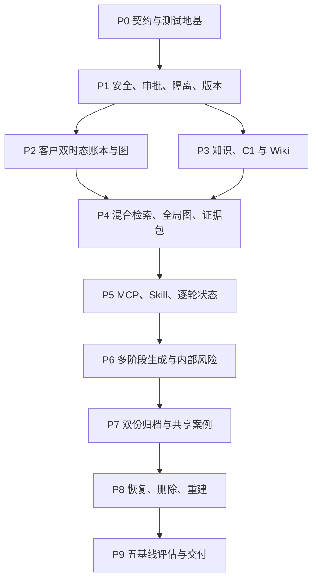

# 咨询知识库系统实施总计划

> **Agent execution:** 按阶段内的内聚批次交付。Superpowers 插件下的全部 Skill 与其他流程 Skill 均只按需调用：仅在用户明确点名，或任务与 Skill 描述清晰匹配且能实质改善结果时选择最小相关集合；普通对话、弱关键词和仪式性合规不触发。复选框用于追踪范围与验收，不代表每个 Task 必须独立对话、独立提交、完整 TDD 或重复复审。

**Goal:** 在保留上游 Graphify 兼容性的前提下，实现一个可直接由 Codex 使用的、本地优先、单咨询师、文本咨询知识库系统；它同时具备经审核 LLM Wiki、中文混合 RAG、Graphify 全局图、每客户双时态账本/时态图、C1 最高框架治理、逐轮实际回复记录、双份归档、共享案例全谱系排除、内部风险观察以及可复现质量评估。

**Architecture:** 权威来源和审核事件存放在 Git 之外的本地 vault；SQLite 是全局治理与客户事实的事务真相源，不可变内容寻址文件是正文和派生工件载体；Wiki、BM25/FTS5、精确向量索引和图都是可重建派生层。Codex 通过一个本地 STDIO MCP 控制面和三个项目 Skill 使用系统，客户私有查询通过不透明会谈 capability 绑定到单客户 worker。正式写入全部经过差异预览、不可伪造的一次性人工批准、`DRAFT → PREPARED → ACTIVE` 发布和版本校验。

**Tech Stack:** 咨询生产运行时 CPython 3.12 x64；上游 `graphifyy` 发行元数据继续支持 Python 3.10+；stdlib `sqlite3`/FTS5；NetworkX 与现有 Graphify；Pydantic v2；NumPy 精确余弦；jieba + 汉字 2/3-gram；可插拔 Sentence Transformers embedding/cross-encoder；MCP Python SDK v1 STDIO；pywin32 DPAPI/ACL/最终路径；pytest、Hypothesis、ruff、mypy；PowerShell/Codex 项目配置。

## Global Constraints

1. 规范真相源是 [已批准设计规格](../specs/2026-07-16-consultation-knowledge-base-design.md)。本计划只能细化，不得降低其中的隔离、来源客户排除、有效事实、人工批准、风险输出隔离、事务、删除和重建约束。
2. 上游依赖方向固定为 `consultation_kb → graphify`。禁止 `graphify → consultation_kb`；客户图不得调用上游单边、无权路径或 Wiki 导出查询器。
3. 不提高 `graphifyy` 的 `requires-python >=3.10`。所有 `consultation_kb` 源码须能被 Python 3.10 解析，`consultation-kb` 通过轻量 entrypoint 在导入任何咨询依赖前检查运行时；低于 3.12 时只输出确定性不支持消息并退出，不暴露半可用能力。生产、测试和支持承诺仍从 3.12 起。
4. Git 只保存代码、Schema、策略、合成测试数据和文档。真实客户正文、稳定身份标识、vault、SQLite/WAL/SHM、embedding、模型缓存和泄漏报告不得进入 Git。
5. 在 P8 的 `TX-01`、`VER-01`、`DEL-01`、`REBUILD-01` 全部通过前，只使用合成数据或为测试明确授权的数据。
6. 任何候选进入模型上下文前，先执行客户作用域、用途授权、审核状态、时效、tombstone、敏感级别和传递性 `provenance_client_ids` 过滤。不得先把无权正文交给模型再靠 Prompt 删除。
7. C1 仅指咨询师自创并正式批准的理论修订。适用且 active 的 C1 是所有资料中的最高咨询框架，但不能改写 T1 原文、L1 当前官方事实、客户事实、法律/专业边界或任何确定性硬约束。
8. `source_grade=C1`、`framework_priority=highest` 与 `empirical_support` 是三个独立字段。模型、子代理、案例反馈和普通审核者只能提出 C1 草稿，不能批准、提升、修订或废止 C1。
9. 每轮多个候选回复都不是实际回复。上一轮必须记录 `actual_reply_recorded` 或明确的 `external_reply_unknown` 后才能接受下一条来访者消息。
10. 普通和高关注风险只在咨询师内部对象中显示。来访者回复 Schema 永远不包含风险标签、级别、规则名或系统告警文案。
11. 验证按第 9 节分为 A/B/C 三级；只有 A 级关键不变量、行为回归和安全修复强制测试先行。B/C 级可以集中实现后验证，但任何等级都不得降低第 7 节强制验收、隐私扫描或确定性正确性约束。
12. 不设主观质量“上线门”，但确定性正确性约束必须 100% 通过。质量指标作为持续回归下限和优化方向。
13. 每个内聚批次使用一个或少量原子、可回滚的 Git 提交；不得为了 Task 编号机械拆分提交，也不得把无关改动并入批次或修改用户已有的无关工作树变更。

---

## 1. 计划集与执行顺序

| 阶段 | 状态 | 计划 | 最小垂直闭环 | 首次负责验收 |
|---|---|---|---|---|
| P0 | 已完成（`5324c4c`） | [契约与测试地基](2026-07-16-consultation-kb-p0-contracts-test-foundation.md) | `doctor → 合成 vault → Schema/隐私扫描 → 上游基线` | 全局范围、测试与日志约束 |
| P1 | 已完成（`1159ffe`） | [安全 vault、审批、隔离与版本底座](2026-07-16-consultation-kb-p1-security-storage-isolation.md) | `创建 A/B → 打开 A capability → B/路径逃逸全部失败` | `ISO-01`、`ISO-02` 初版、`WRITE-01`、`VER-01` 底座 |
| P2 | 已完成（`605a7fc`） | [客户双时态账本与时态图](2026-07-16-consultation-kb-p2-client-ledger-temporal-graph.md) | `旧伴侣甲 → 新伴侣乙 → 当前/历史/边效应正确` | `FACT-01`、客户侧 `GRAPH-01` |
| P3 | 已完成（`605a7fc`） | [知识、C1 与 LLM Wiki](2026-07-16-consultation-kb-p3-knowledge-c1-wiki.md) | `来源 → Passage/Claim → C1 批准 → Wiki 发布/lint` | `THEORY-01` 治理、`WRITE-01` 扩展 |
| P4 | 已完成（`8ca6beb`） | [混合检索、Graphify 全局图与证据包](2026-07-16-consultation-kb-p4-retrieval-global-graph.md) | `精确原句 + 改写语义 + 图路径 + C1/反证 → EvidencePack` | 全局 `GRAPH-01`、运行时 `THEORY-01`、`VER-01` |
| P5 | 已完成（`b808897`） | [统一 MCP、Codex Skill 与逐轮会谈](2026-07-16-consultation-kb-p5-session-mcp-codex.md) | `开始 A → 两轮实际回复 → 中断恢复 → 正确关闭` | `TURN-01`、经 MCP 重跑 `ISO-01` |
| P6 | 已完成（`8814025`） | [多阶段生成、一致性与内部风险](2026-07-16-consultation-kb-p6-generation-consistency-risk.md) | `权威 C1/证据包 → 多角色工件 → 逐字 claim 覆盖 → 审计/风险隔离 → 真实 STDIO` | `RISK-01`、生成侧 `THEORY-01` |
| P7 | 已完成（`7879f0b`） | [双份归档、共享案例与全谱系排除](2026-07-16-consultation-kb-p7-archive-shared-cases.md) | `私有归档/资料差异独立成功 → 可选共享 → A 自案例全通道排除` | `CASE-01`、`CASE-02`、`ARCHIVE-01`、`TX-01` saga |
| P8 | 已完成（范围、强制验收、分轨全树与静态门禁已收口） | [崩溃恢复、删除与重建](2026-07-16-consultation-kb-p8-recovery-deletion-rebuild.md) | `逐点杀进程 → 旧/新版完整可见 → tombstone → 物理清理 → 重建` | `TX-01`、`VER-01`、`DEL-01`、`REBUILD-01` |
| P9 | 实施中 | [质量评估与交付](2026-07-16-consultation-kb-p9-evaluation-delivery.md) | `合成端到端咨询 → 五基线/消融 → 评估报告 → Codex 演练` | 全部 15 项强制验收与质量目标 |



P2 和 P3 在 P1 完成后可并行；P4 内部的词法、向量和全局图实现可并行，但必须在统一过滤器和 `EvidencePack` 合流后才算完成。P6 内部的生成契约与风险引擎可并行，最后用来访者输出 Schema 集成。阶段内部应让独立实现区域、测试和安全/策略审查并行推进，由单一集成负责人合流；不为相同 diff 串行重复同一审查。

---

## 2. 目标文件边界

```text
consultation_kb/
├─ __init__.py
├─ __main__.py
├─ cli.py
├─ core/                 # config、clock、ids、errors、result envelope
├─ vault/                # layout、content-addressed objects
├─ security/             # capability、path guard、scoped worker、DPAPI、NTFS
├─ approvals/            # preview request、out-of-band confirmation、receipt
├─ storage/              # SQLite connection、migration、catalog、ledger、manifest、outbox
├─ models/               # knowledge、client、case、evidence、generation、risk contracts
├─ client/               # bitemporal ledger service、profile、dependency、MultiDiGraph
├─ knowledge/            # ingest、Passage/Claim、C1、Wiki、lint、invalidation
├─ retrieval/            # filters、lexical、vector、fusion、rerank、EvidencePack
├─ graph/                # Graphify adapter、weighted path、serialization
├─ session/              # snapshot、temporary ledger、turn state、actual reply
├─ generation/           # stage contracts/store、theory policy、consistency
├─ risk/                 # deterministic rules、model observation merge、projection
├─ archive/              # private record、profile diff、deidentification、shared case
├─ lifecycle/            # publish、recovery、deletion、rebuild
├─ observability/        # no-body audit、run manifest
├─ evaluation/           # datasets、metrics、baselines、runner、report
└─ mcp/                  # top-level testable handlers + thin STDIO registration

consultation_kb/storage/migrations/{global,client}/
schemas/
policies/
requirements/
tests/consultation_kb/{unit,integration,fault,golden}/
tests/fixtures/consultation_kb/
.agents/skills/{consultation-session,knowledge-curator,quality-evaluator}/
.codex/config.template.toml
.codex/start-consultation-kb.ps1
AGENTS.md
docs/consultation-kb/{operations,recovery,deletion,evaluation}.md
```

### 2.1 原则上不修改的上游文件

- `graphify/build.py`
- `graphify/serve.py`
- `graphify/wiki.py`
- `graphify/cache.py`
- `graphify/__main__.py`
- `graphify/skill*.md`

若实现发现通用 Graphify 缺陷，单独提交，使用上游模块测试证明其通用性；客户时态、隐私、审批或账本语义不得进入 `graphify/`。

---

## 3. 冻结的跨阶段接口

所有 Pydantic 模型使用 `ConfigDict(strict=True, extra="forbid", frozen=True)`；所有时间为带时区 UTC `datetime`；所有哈希为小写 SHA-256 十六进制；所有枚举值写入 Schema 并保持向后兼容。

### 3.1 核心 ID 与版本

| 类型 | 格式 | 创建者 | 不变量 |
|---|---|---|---|
| `client_id` | `client_[a-z0-9]{12}` | `create_client` | 不含真实姓名，不可重用 |
| `session_id` | UUIDv7 字符串 | 会谈控制面 | 永久绑定一个客户 |
| `turn_id` | UUIDv7 字符串 | `append_session_turn` | 幂等，严格属于一个 session |
| `run_id` | UUIDv7 字符串 | 每轮/归档/评估入口 | 贯穿检索、生成、审核和审计 |
| `object_id` | `<kind>_<uuidv7>` | 对应仓储 | 跨版本稳定；kind 长度1..64且以full-match匹配 `[a-z][a-z0-9]*(?:_[a-z0-9]+)*`，并不得含任何 `client_[a-z0-9]{12}` 子串 |
| `commit_version` | 正整数 | 单库提交器 | 在该 SQLite 中单调递增 |
| `content_sha256` | 64 位小写 hex | `ContentStore` | 对 canonical bytes 计算 |

P0 定义并由后续计划消费的接口：

```python
class Clock(Protocol):
    def now(self) -> datetime: ...

class IdFactory(Protocol):
    def new(self, prefix: str) -> str: ...

class VersionRef(BaseModel):
    model_config = ConfigDict(strict=True, extra="forbid", frozen=True)
    object_id: ObjectId
    version: PositiveInt
    content_sha256: Sha256Hex

class FrozenSafeDetails(Mapping[str, str | int | bool]):
    """Canonical copied immutable mapping that serializes as a JSON object."""

class ToolError(BaseModel):
    model_config = ConfigDict(strict=True, extra="forbid", frozen=True)
    code: NonEmptyStr
    message: NonEmptyStr
    retryable: bool = False
    safe_details: FrozenSafeDetails = EMPTY_SAFE_DETAILS
```

`SystemClock.now()` 必须返回aware UTC；`FixedClock` 在构造时拒绝naive或非零offset。UUIDv7的可注入74-bit随机源只接受exact `int`（`bool`/float/string均拒绝），接受 `0`/`2**74-1` 边界，拒绝负数/`>=2**74`；48-bit毫秒越界拒绝而非截断。

`FrozenSafeDetails` 在验证时只接受 `str | int | bool` 标量值，拒绝所有嵌套容器，复制输入并按key canonical排序，禁止item mutation，默认序列化仍是JSON object；修改原始输入mapping不能改变已构造的错误。所有 `StrictModel` object Schema使用 `additionalProperties:false`，但该mapping是唯一明确例外，其 `additionalProperties` 必须限制为上述scalar union。`safe_details` 禁止包含正文、其他客户 ID、路径或对象存在性。跨客户探测统一返回 `SCOPE_DENIED`，不能区分“不存在”和“无权”。Task 3必须测试字段重绑定、item mutation、嵌套容器拒绝、输入alias mutation和JSON round-trip，不能把Pydantic `frozen=True` 误当成深层冻结。

### 3.2 Scope、批准与发布

```python
class SessionScope(BaseModel):
    model_config = ConfigDict(strict=True, extra="forbid", frozen=True)
    session_handle: NonEmptyStr
    session_id: Uuid7String
    permissions: frozenset[Literal["client_read", "session_append", "draft_write"]]
    expires_at: UtcDateTime

class DraftDescriptor(BaseModel):
    model_config = ConfigDict(strict=True, extra="forbid", frozen=True)
    purpose: Literal[
        "create_client", "profile_update", "private_archive_publish",
        "case_publish", "claim_approve", "claim_revoke",
        "theory_approve", "theory_revoke", "wiki_publish",
        "rebuild", "rollback", "delete"
    ]
    target_id: NonEmptyStr
    client_id: ClientId | None = None
    base_version: NonNegativeInt
    draft_sha256: Sha256Hex
    session_id: Uuid7String | None = None

class ApprovalReceipt(BaseModel):
    model_config = ConfigDict(strict=True, extra="forbid", frozen=True)
    request_id: ObjectId
    descriptor_sha256: Sha256Hex
    approver_role: Literal["primary_counselor"]
    approved_at: UtcDateTime
    expires_at: UtcDateTime
    nonce: NonEmptyStr
    provider_id: NonEmptyStr
    signature: NonEmptyStr

class ApprovalExecution(BaseModel):
    model_config = ConfigDict(strict=True, extra="forbid", frozen=True)
    operation_id: ObjectId
    request_id: ObjectId
    descriptor_sha256: Sha256Hex
    target_scope_hash: Sha256Hex
    state: Literal["issued", "claimed", "applied", "acknowledged"]
    applied_commit_version: PositiveInt | None = None
```

`ApprovalReceipt.expires_at` 必须严格晚于 `approved_at`。`ApprovalExecution` 在 `issued/claimed` 时commit为空，在 `applied/acknowledged` 时必须有正 `applied_commit_version`。

- 预览工具只返回 `approval_request_id`、`draft_sha256`、`base_version` 和人类可读 diff。
- 正式写工具不把裸 receipt 返回给模型。控制面按 request ID 取得签名 receipt；目标 SQLite 在**同一业务事务**中校验签名/descriptor/client scope，把 nonce 与 `operation_id` 写入唯一 `approval_executions` 行，完成业务写并标 `applied`。重复、过期、跨目标、版本/哈希变化均拒绝。
- 全局 approval DB 的 `acknowledged` 只是目标事务成功后的可恢复回执，不是业务提交前的“先消费”。崩溃发生在目标提交前时没有可见消费；发生在目标提交后、全局回执前时，重试通过目标 `operation_id` 幂等确认并补回执。
- MCP `default_tools_approval_mode="writes"` 只作为宿主 UX 和纵深防御。除非宿主将不可伪造批准证明传给服务端，否则正式批准由独立本地 review agent 产生。
- 发布统一使用 `PublishCoordinator.prepare()`、`verify()`、`activate()`；`ManifestRepository` 只提供 `insert_prepared/get/activate_expected` 等持久化原语，不能另造一套发布 API。
- 一个逻辑正式变更使用单一 `PublicationOperation(operation_id, authority_base_version, approval_request_id, required_manifest_ids, state, runtime_epoch)`。先把全部必需派生物 stage；再在其权威 SQLite 的一个事务中写审核执行、权威事件与 PREPARED manifests；验证全套 closure 后，在一个事务中切换该 scope 的 active runtime epoch。查询固定读取一个已激活 epoch，绝不混合“新事实 + 旧 profile/graph/index”。

### 3.3 双时态事实与四个正交状态轴

```python
class FactState(BaseModel):
    model_config = ConfigDict(strict=True, extra="forbid", frozen=True)
    review_status: Literal["proposed", "reviewed", "approved", "rejected"]
    validity_status: Literal["active", "superseded", "invalidated", "historical"]
    resolution_status: Literal["open", "resolved", "not_applicable"]
    epistemic_status: Literal["asserted", "uncertain", "disputed"]

class BitemporalWindow(BaseModel):
    model_config = ConfigDict(strict=True, extra="forbid", frozen=True)
    effective_from: UtcDateTime
    effective_to: UtcDateTime | None
    recorded_at: UtcDateTime
    superseded_at: UtcDateTime | None
```

任何仓储或查询 API 都不得接受一个合并 `status` 字段。历史查询显式接受 `effective_at` 和 `known_at`；不传时使用当前时间，但仍把两个值写入 `run_id` 记录。

### 3.4 来源谱系与检索候选

P0 在首个 Schema 发布前冻结 `ClientId`、`ObjectId`、`Uuid7String`、`UtcDateTime`、`Sha256Hex`、`NonNegativeInt`、`NonEmptyStr`、`SafePolicyKey` 与 `FiniteFloat` 等共同严格类型。`SafePolicyKey` 长度1..64、full-match `[a-z][a-z0-9]*(?:_[a-z0-9]+)*`，拒绝任意client-ID子串、控制字符、路径/遍历与自由正文。完整客户谱系只用于服务端 catalog/filter/integrity；进入生成上下文的是单向安全投影，不能靠调用方临时 `exclude` 字段。

```python
SourceGrade = Literal[
    "T1", "T2", "T3", "T4",
    "C1", "C2", "C3", "C4", "C5", "C6",
    "K1", "K2", "K3", "K4",
    "L1", "L2", "L3", "L4",
]
EmpiricalSupport = Literal[
    "unassessed", "case_supported", "observation_supported",
    "empirically_supported", "guideline_consistent", "conflicting",
]

class Provenance(BaseModel):
    model_config = ConfigDict(strict=True, extra="forbid", frozen=True)
    source_ids: frozenset[ObjectId] = frozenset()
    passage_ids: frozenset[ObjectId] = frozenset()
    case_ids: frozenset[ObjectId] = frozenset()
    client_ids: frozenset[ClientId] = frozenset()
    provenance_scope: Literal["global_source", "client_private", "case_derived", "mixed"]
    private_owner_client_id: ClientId | None = None
    case_contributor_client_ids: frozenset[ClientId] = frozenset()
    derivation_rule_ref: VersionRef

class RetrievalScope(BaseModel):
    model_config = ConfigDict(strict=True, extra="forbid", frozen=True)
    current_client_id: ClientId
    allowed_uses: frozenset[NonEmptyStr]
    maximum_sensitivity: NonNegativeInt
    effective_at: UtcDateTime
    known_at: UtcDateTime

class AuthoritativeFilterSnapshot(BaseModel):
    model_config = ConfigDict(strict=True, extra="forbid", frozen=True)
    run_id: Uuid7String
    global_runtime_epoch: NonNegativeInt
    client_runtime_epoch: NonNegativeInt
    tombstone_epoch: NonNegativeInt
    authorization_epoch: NonNegativeInt
    allowed_ref_ids: frozenset[ObjectId]
    policy_ref: VersionRef
    created_at: UtcDateTime

class AuthoritySnapshotBinding(BaseModel):
    model_config = ConfigDict(strict=True, extra="forbid", frozen=True)
    snapshot_ref: VersionRef
    run_id: Uuid7String
    global_runtime_epoch: NonNegativeInt
    client_runtime_epoch: NonNegativeInt
    tombstone_epoch: NonNegativeInt
    authorization_epoch: NonNegativeInt
    policy_ref: VersionRef
    created_at: UtcDateTime

class EvidenceProvenanceView(BaseModel):
    model_config = ConfigDict(strict=True, extra="forbid", frozen=True)
    provenance_ref: VersionRef
    provenance_scope: Literal["global_source", "client_private", "case_derived", "mixed"]
    derivation_rule_ref: VersionRef
    source_count: NonNegativeInt
    passage_count: NonNegativeInt
    case_count: NonNegativeInt
    case_contributor_count: NonNegativeInt
    independent_source_count: NonNegativeInt
    client_exclusion_status: Literal[
        "not_applicable", "current_subject_private",
        "no_subject_contribution", "leave_one_subject_out_applied",
    ]

class EvidenceLocator(BaseModel):
    model_config = ConfigDict(strict=True, extra="forbid", frozen=True)
    locator_kind: Literal[
        "source_page_span", "source_paragraph_span", "source_line_span",
        "source_table_span", "source_sheet_range", "client_fact",
        "session_turn", "wiki_section", "case_turn", "graph_path",
    ]
    anchor_refs: tuple[VersionRef, ...]  # at least one, canonical order
    display_locator: SafeLocatorText
    locator_policy_ref: VersionRef

class EvidenceFreshnessSnapshot(BaseModel):
    model_config = ConfigDict(strict=True, extra="forbid", frozen=True)
    status: Literal["current", "historical", "stale", "not_time_sensitive"]
    evaluated_at: UtcDateTime
    source_observed_at: UtcDateTime | None
    last_reviewed_at: UtcDateTime | None
    review_due_at: UtcDateTime | None
    policy_ref: VersionRef

class EvidenceCandidate(BaseModel):
    model_config = ConfigDict(strict=True, extra="forbid", frozen=True)
    evidence_id: ObjectId
    text_ref: VersionRef
    location: EvidenceLocator
    freshness: EvidenceFreshnessSnapshot
    channel: Literal["profile", "client_history", "wiki", "lexical", "vector", "global_graph", "case"]
    review_status: Literal["approved"]
    source_grade: SourceGrade
    framework_priority: Literal["highest", "normal", "not_applicable"]
    empirical_support: EmpiricalSupport
    provenance: EvidenceProvenanceView
    supports_evidence_ids: tuple[ObjectId, ...]
    contradicts_evidence_ids: tuple[ObjectId, ...]
    score: FiniteFloat
```

`SafeLocatorText` 最长512字符并拒绝控制字符、任意 `client_[a-z0-9]{12}`、drive/UNC/absolute/relative path、`..` traversal和自由正文。`EvidenceLocator` 按 `locator_kind` 固定唯一语法验证：`source_page_span=pages:<p1>:<b1>-<p2>:<b2>`、`source_paragraph_span=paragraphs:<a>-<b>`、`source_line_span=lines:<a>-<b>`、`source_table_span=table:<n>;rows:<a>-<b>;columns:<c>-<d>`、`source_sheet_range=sheet:<n>;range:<A1>-<B2>`、`client_fact=fact:<ObjectId>`、`session_turn=turn:<canonical-lowercase-UUIDv7>`、`wiki_section=section:<slug>`、`case_turn=case:<ObjectId>;turn:<n>`、`graph_path=path:<64-lowercase-hex>`。所有数字匹配无前导零的 `[1-9][0-9]*`；PDF起止 `(page,block)`、普通span和spreadsheet rectangle均必须有序；sheet cell使用uppercase `[A-Z]+[1-9][0-9]*`；section slug匹配 `[a-z0-9]+(?:-[a-z0-9]+)*` 且最长128字符。P3必须把PDF映射为可同页或跨页的page/block pair、DOCX映射为paragraph或table、TXT/MD映射为line、CSV映射为table、XLSX映射为sheet/range，不得伪造不存在的页码；缺失必需坐标的文档不能产出approved Passage。这些短串只由P4受控renderer从approved `PassageAnchor`产生；人类标题/正文通过已授权anchor resolver呈现，不能塞进pack字段。`anchor_refs` 至少一个、按 `(object_id, version, content_sha256)` canonical排序并属于同一获准evidence closure。freshness中 `source_observed_at`/`last_reviewed_at` 如存在都不得晚于 `evaluated_at`，两者互不要求先后；`stale` 必须 `review_due_at <= evaluated_at`，`current` 必须无due time或due time在未来。

每轮从 live authority DB冻结私有的 `AuthoritativeFilterSnapshot`。词法、向量和图检索器必须在评分/排名/`LIMIT` 前使用唯一公共字段名 `allowed_ref_ids` 预筛，防止已撤回高分行挤掉合法结果；`CandidateFilter.filter(scope, candidates)` 再作为所有通道进入融合器的唯一二次入口。resolver前若任一 epoch变化，旧snapshot失效并重跑。`client_private`只能由其owner在profile/client-history通道读取，不能当“相似案例”展示；只有当前客户出现在 `case_contributor_client_ids` 时才执行案例/派生对象的排除或LOO。过滤成功后，P4把完整 `Provenance` 单向投影成 `EvidenceProvenanceView`；`EvidencePack` 的类型图、Schema和默认序列化不得出现任何客户ID字段。完整snapshot只存当前scope受治理对象；生成阶段只接收不含 `allowed_ref_ids` 的 `AuthoritySnapshotBinding`。P4必须成对测试“本客户私有历史允许”和“本客户案例谱系排除”，P7再接真实共享案例。

完整 `Provenance` 的本地矩阵同样不得延后：`global_source` 要求非空source、空case/client/contributor且无private owner；`client_private` 要求private owner、`client_ids={owner}`、空source/case/contributor，允许受本客户scope保护的session/case Passage IDs，owner不得自动成为case contributor；`case_derived` 要求非空case/contributor、`client_ids=contributors`、空source且无private owner，允许approved case-turn Passage IDs；`mixed` 专指global-source + case-derived闭包，要求非空source/case/contributor、`client_ids=contributors`且无private owner。所有ID集合以canonical顺序序列化。

safe view/pack的本地组合不变量：`AuthoritySnapshotBinding.run_id == EvidencePack.run_id`；`global_source` 只允许 `wiki/lexical/vector/global_graph + not_applicable` 且 `source_count/independent_source_count>=1, case_count=case_contributor_count=0`；`client_private` 只允许 `profile/client_history + current_subject_private` 且 `source_count=case_count=case_contributor_count=independent_source_count=0`，`passage_count`可表示本客户私有session/case Passage；`case_derived` 只允许 `case/wiki/lexical/vector/global_graph + no_subject_contribution|leave_one_subject_out_applied` 且 `source_count=independent_source_count=0, case_count/case_contributor_count>=1`，`passage_count`可表示approved case-turn Passage；`mixed` 使用同一通道/排除状态但要求 `source_count/independent_source_count/case_count/case_contributor_count>=1`。`independent_source_count` 不得大于 `source_count`；LOO状态必须使用已批准变体的refs。任何pack-visible enum/string常量自身也不得匹配 `client_[a-z0-9]{12}`，不能制造合法canary的假阳性。除此之外的组合一律非法。外部bytes、scope、授权、epoch和manifest membership仍由P4/P8验证。

### 3.5 版本化证据包

```python
class C1ApplicabilityDecision(BaseModel):
    model_config = ConfigDict(strict=True, extra="forbid", frozen=True)
    status: Literal["applicable", "not_applicable", "insufficient_context", "unavailable"]
    revision: VersionRef | None
    scope_policy_ref: VersionRef
    matched_rule_ids: tuple[SafePolicyKey, ...]
    missing_context_fields: tuple[SafePolicyKey, ...]
    effective_status: Literal["active", "expired", "superseded", "revoked", "none"]
    empirical_support: EmpiricalSupport
    conflict_evidence_ids: tuple[ObjectId, ...]

class EvidencePack(BaseModel):
    model_config = ConfigDict(strict=True, extra="forbid", frozen=True)
    schema_version: Literal["1.0"] = "1.0"
    run_id: Uuid7String
    authority: AuthoritySnapshotBinding
    client_snapshot_ref: VersionRef
    temporary_fact_refs: tuple[VersionRef, ...]
    supporting: tuple[EvidenceCandidate, ...]
    contradicting: tuple[EvidenceCandidate, ...]
    unresolved_conflict_refs: tuple[VersionRef, ...]
    c1_applicability: C1ApplicabilityDecision
    exclusion_proof_ref: VersionRef
    wiki_manifest_ref: VersionRef
    lexical_manifest_ref: VersionRef
    vector_manifest_ref: VersionRef
    graph_manifest_ref: VersionRef
    reranker_descriptor_ref: VersionRef
```

`EvidencePack` 只允许引用内容寻址对象；除固定 `schema_version` 外所有字段必填，tuple即使为空也必须显式出现。包内candidate ID、`supports_evidence_ids`/`contradicts_evidence_ids`和C1 conflict ID只能作同包candidate交叉引用，解析不得离开pack；每个target必须出现在supporting/contradicting并集，禁止self/dangling/tuple内重复，同一candidate的support/contradict target集合必须不相交。两个顶层序列各自不许重复ID；同一candidate可因不同问题侧面同时位于两组，但两份对象必须逐字节相同，融合/预算只计一个唯一evidence ID。supporting/contradicting按evidence ID，candidate内部support/contradict ID与C1 conflict ID按ObjectId，temporary facts/unresolved conflicts/locator anchors按 `(object_id,version,content_sha256)` canonical排序；这些集合语义tuple的输入顺序不得改变pack hash。任何需要DB/CAS/catalog/model resolver的对象一律使用精确 `VersionRef`，禁止 object-id-to-latest。四个 `*_manifest_ref` 必须指向经验证的不可变根manifest并传递覆盖成员、source snapshot、builder/model/config hashes；reranker的fallback/no-op也有不可变descriptor ref。生成阶段通过受控 resolver 读取已过滤正文，但无权解析完整authority snapshot或完整provenance。

`C1ApplicabilityDecision` 的本地状态矩阵完全冻结：`applicable`/`not_applicable` 都要求revision、`active`、空missing-context且至少一个matched/exclusion rule；`insufficient_context` 要求revision、`active`和非空missing-context；`unavailable + none` 要求无revision、空matched/missing且 `empirical_support=unassessed`；`unavailable + expired|superseded|revoked` 要求revision和空missing；`unavailable + active` 永远非法。`matched_rule_ids`/`missing_context_fields` 各自去重并canonical排序，只能使用 `SafePolicyKey`；P3/P4还必须验证前者属于 `scope_policy_ref` manifest的approved rule成员、后者属于同一manifest的approved context-field词表。`conflict_evidence_ids` 在装入pack时必须全部命中pack candidate并只作本地引用。C1 的“无适用版本”和“上下文不足”是两个不同状态；decision 的 canonical hash 属于 run manifest，任何阶段不得从普通候选自报或“猜一个”C1。

### 3.6 会谈和生成阶段

会谈状态固定为：

```text
client_turn_received
→ generation_in_progress
→ candidates_generated
→ awaiting_actual_reply
→ actual_reply_recorded | external_reply_unknown
→ turn_closed
```

生成工件顺序固定为：

```text
query_plan
→ conceptualization
→ theory_comparison
→ reply_drafts
→ evidence_audit
→ consistency_risk_review
→ final_bundle
```

Task 3首发的三个最小root shape精确冻结；P6通过组合增加body/lifecycle，不修改这些v1 roots：

```python
GenerationStageName = Literal[
    "query_plan", "conceptualization", "theory_comparison",
    "reply_drafts", "evidence_audit", "consistency_risk_review",
    "final_bundle",
]

class GenerationStageEnvelope(BaseModel):
    model_config = ConfigDict(strict=True, extra="forbid", frozen=True)
    schema_version: Literal["1.0"] = "1.0"
    stage: GenerationStageName
    turn_id: Uuid7String
    run_id: Uuid7String
    parent_sha256s: tuple[Sha256Hex, ...]
    created_at: UtcDateTime

class ClientReplyOutput(BaseModel):
    model_config = ConfigDict(strict=True, extra="forbid", frozen=True)
    schema_version: Literal["1.0"] = "1.0"
    text: NonEmptyStr

class InternalRiskObservation(BaseModel):
    model_config = ConfigDict(strict=True, extra="forbid", frozen=True)
    schema_version: Literal["1.0"] = "1.0"
    observation_id: ObjectId
    category: SafePolicyKey
    level: Literal["general", "high"]
    trigger_turn_ids: tuple[Uuid7String, ...]
    rule_ref: VersionRef
    detected_at: UtcDateTime
    suggested_questions: tuple[NonEmptyStr, ...]
    client_facing_visibility: Literal["never"] = "never"
```

`parent_sha256s` 和 `trigger_turn_ids` 必须显式提供、去重并分别按hash/UUID canonical排序；前者可空，后者至少一个。`suggested_questions` 至少一个、拒绝空白/重复并保留作者顺序。Task 3不在本地猜stage-specific parent数量、风险confidence或生命周期字段；这些由P6组合模型冻结。`ClientReplyOutput` 的类型图/Schema只能含schema version与文本，不含任何risk字段。

`query_plan` 只绑定 run、turn 与 client snapshot，不含尚未产生的 EvidencePack hash。检索完成后，`conceptualization` 及其后所有阶段必须绑定同一个 pack hash和上一步 parent hash。提交第一个 plan 时进入 `generation_in_progress`；`final_bundle` 通过统一 `CandidateSetService` 原子保存候选并依次记录 `candidates_generated`、`awaiting_actual_reply`。

第一阶段不调用独立 OpenAI API。Codex Skill 负责逐阶段推理并通过 MCP 提交结构化工件；本地服务负责顺序、Schema、引用完整性、C1 规则、风险隔离、重试上限和持久化。后续若增加 API runner，只能实现同一 `StageRunner` 协议，不改变领域合同。

---

## 4. 数据库与文件版本协议

### 4.1 SQLite 连接规则

- `isolation_level=None`，所有写入显式 `BEGIN IMMEDIATE / COMMIT / ROLLBACK`。
- `PRAGMA foreign_keys=ON`、`busy_timeout=5000`；写库 `journal_mode=WAL`、`synchronous=FULL`；每个数据库一个 writer。
- 迁移是编号 Python 模块，`upgrade(conn)` 执行固定 SQL；`schema_migrations` 保存版本、名称、SHA-256、应用时间和应用版本。
- 迁移 checksum 变化时启动失败；不能静默重跑已修改迁移。
- 启动 doctor 实际创建/查询临时 FTS5 表，不只检查 compile options。
- 切换不可变版本前关闭 mmap/SQLite 句柄并 checkpoint WAL。

### 4.2 工件和 active 指针

内容寻址存储按 scope 物理分开，禁止跨客户去重或存在性探测：

```text
<vault>/global/.staging/<purpose>/<manifest_id>/<sha256>/...
<vault>/global/objects/sha256/<first-two>/<sha256>/...
<vault>/clients/<client_id>/.staging/<purpose>/<manifest_id>/<sha256>/...
<vault>/clients/<client_id>/objects/sha256/<first-two>/<sha256>/...
```

`ContentStore(scope_root)` 只能在已验证的 global root 或当前 scoped-worker client root 内工作。客户会谈、profile、客户图与私有归档永不进入 global CAS；只有 P7 经授权、去标识化、人工审核和 outbox 复制后，独立的共享案例对象才进入 global CAS。

SQLite `publication_operations`/`runtime_epochs` 与 `artifact_manifests` 保存 `DRAFT/STAGED/PREPARED/ACTIVE/ABORTED/RETIRED`、对象清单、源版本和目标用途。查询不扫描目录，只读取一个 active runtime epoch 下的 `active_artifacts` 指针并逐项验证文件存在、SHA-256 和 `source_version`。任何失败返回 `ARTIFACT_VERSION_MISMATCH` 并 fail closed。

### 4.3 删除优先级

删除、撤回和权限收紧先在权威库写 tombstone。所有 SQL、图、词法、向量、Wiki 和缓存查询在读正文前检查 tombstone。物理清理、旧版本回收、WAL/SHM/空闲页处理和备份销毁在 P8 完成，但 tombstone 从 P1 开始就是查询入口硬依赖。

---

## 5. 依赖与环境基线

P0 将 `pyproject.toml` 扩展为：

```toml
[project.optional-dependencies]
mcp = ["mcp>=1.28.1,<2"]
consultation-core = [
  "pydantic>=2.13.4,<3",
  "numpy>=1.26.4,<3",
  "jieba==0.42.1",
  "PyYAML>=6.0.2,<7",
  "pywin32>=312,<313; sys_platform == 'win32'",
]
consultation-ml = ["sentence-transformers>=5.6,<6"]
consultation-test = [
  "mcp[cli]>=1.28.1,<2",
  "pytest>=8.3,<10",
  "pytest-cov>=6,<8",
  "hypothesis>=6.100,<7",
  "ruff>=0.8,<1",
  "mypy>=2.1,<3",
  "types-pywin32>=312.0.0.20260609,<313; sys_platform == 'win32'",
  "pip-tools==7.5.3",
]

[tool.mypy]
python_version = "3.12"
strict = true
plugins = ["pydantic.mypy"]
```

首个生产锁定环境为 CPython 3.12 x64，生产 core lock 必须包含现有 `leiden` extra，graph manifest 断言实际 backend 为 Leiden；若缺失只能明确进入 Louvain degraded mode，不能把结果伪装为同一版本。上游 Python 3.10 轨只验证 Graphify 回归、`consultation_kb` 全树可解析以及咨询 entrypoint 明确拒绝运行，不构成咨询运行时支持。Python 3.13 是 P9 独立兼容矩阵，生成单独 hash lock、干净 venv，并明确预期无可选 Leiden。`torch` 不写入通用 `pyproject.toml`，Windows CPU wheel由模型 lock 的直接 wheel URL+SHA-256固定；正式 embedding/reranker 模型必须经过 P9 本系统金标准比较。

生产 3.12 必须是独立安装的 64 位 CPython，不得把 Codex 缓存解释器作为 `.venv` 的 `home/base_prefix`。`requirements/consultation-python.toml` 冻结 3.12 系列、最低安全 patch、架构和禁用路径；`scripts/resolve_consultation_python.ps1` 只输出一个已验证的解释器绝对路径。若本机缺失，执行阶段先取得用户批准，再用官方 Python install manager 的无歧义 `pymanager install 3.12` 安装并重跑解析；legacy `py.exe` 只可用于发现已有运行时，不可用于 manager 安装，也不得被卸载。绝不静默回退到 Codex runtime、3.13 或 32 位 Python。实际 patch、实现、架构、base executable SHA-256 和来源 tag进入无正文运行清单。

第一阶段精确向量基线是 L2 归一化 `float32` `.npy` 不可变分片 + SQLite 行映射 + NumPy `matrix @ query`。ANN 只能作为后续 `VectorIndex` 实现，并以精确基线衡量 Recall；不得替换权限过滤或正确性基线。

Bootstrap 命令：

```powershell
$BootstrapPy = '<CODEX_RUNTIME>\dependencies\python\python.exe'
& $BootstrapPy -c "import sys; print('bootstrap-only', sys.version)"
$ProdPy = (& powershell.exe -NoProfile -ExecutionPolicy Bypass -File .\scripts\resolve_consultation_python.ps1 -SpecPath .\requirements\consultation-python.toml).Trim()
if ($LASTEXITCODE -ne 0) { throw 'Independent CPython 3.12 x64 is required before creating .venv' }
& $ProdPy -m venv .venv
& '.\.venv\Scripts\python.exe' -m pip install 'pip==26.0.1'
& '.\.venv\Scripts\python.exe' -m pip install --require-hashes -r requirements/consultation-win-py312.lock.txt
& '.\.venv\Scripts\python.exe' -m pip install --no-deps -e .
& '.\.venv\Scripts\python.exe' -m pip check
```

P0 即生成并验证不含本项目 editable 行、只含第三方 distribution 的 CPython 3.12 core hash lock；P1–P8 从该 lock 安装。P9 另生成 3.12/3.13 模型 lock，不把全项目塞进 `--require-hashes`。Codex 捆绑 Python 只能执行环境探测/引导脚本；它不得创建或长期运行生产 `.venv`。模型只从本地固定 revision 加载，使用 `local_files_only=True`、`trust_remote_code=False`、`HF_HUB_OFFLINE=1`、`TRANSFORMERS_OFFLINE=1`。

---

## 6. Codex/MCP 部署合同

项目根 `AGENTS.md` 放不可破坏规则；三个 repo Skill 放在 `.agents/skills/<name>/SKILL.md`；仓库提交 `.codex/config.template.toml` 与 wrapper，本机 `.codex/config.toml` 由 `consultation-kb configure-codex` 生成并忽略。相对路径按 `.codex/` 解析，wrapper 自行 `Set-Location` 到 repo root。本地服务使用 STDIO，无端口；stdout 只写 MCP 协议，日志写 stderr。

目标配置：

```toml
[mcp_servers.consultation-kb]
command = "powershell.exe"
args = ["-NoProfile", "-NonInteractive", "-ExecutionPolicy", "Bypass", "-File", "start-consultation-kb.ps1"]
cwd = "."
startup_timeout_sec = 30
tool_timeout_sec = 600
required = true
default_tools_approval_mode = "writes"

```

模板中的 `cwd="."` 指 `.codex/`；因此脚本名直接为 `start-consultation-kb.ps1`。wrapper 从 `$PSScriptRoot` 求 repo root、`.venv` 和同级 vault，设置 UTF8/offline env 后切换 repo root并启动 server。若当前宿主要求绝对路径，configure 命令只在被忽略的本机配置中解析为绝对值；模板、Git 和模型 registry 均不保存机器路径。

正式工具集保持设计规格名称：读取/检索、图查询、会谈草稿/预览和正式写入四组。除 `create_client` 启动预览外，绑定会谈后的客户工具只接受 `session_handle`，不接受 `client_id` 或路径。

---

## 7. 阶段合流强制验收归属与重跑矩阵

| ID | 首次实现 | 必须带 marker 的规范测试模块 | 阶段合流时必须重跑 |
|---|---|---|---|
| `ISO-01` | P1 | `integration/test_iso_01.py` | P5、P7、P8、P9 |
| `ISO-02` | P1 | `integration/test_iso_02.py` | P3、P4、P7、P8、P9 |
| `CASE-01` | P7 | `integration/test_case_01_full_lineage.py` | P8、P9 |
| `CASE-02` | P7 | `integration/test_case_02_authorization.py` | P8、P9 |
| `TURN-01` | P5 | `golden/test_turn_01.py` | P6、P7、P9 |
| `FACT-01` | P2 | `golden/test_fact_01.py` | P5、P7、P9 |
| `THEORY-01` | P3 | `golden/test_theory_01_governance.py` | P4、P6、P9 |
| `GRAPH-01` | P2 客户图、P4 全局图 | `golden/test_graph_01_client.py`、`golden/test_graph_01_global.py` | P7、P9 |
| `WRITE-01` | P1 | `integration/test_write_01.py` | P3、P7、P9 |
| `TX-01` | P1 manifest、P7 saga、P8 故障注入 | `integration/test_manifest_visibility.py`，后续 fault/saga 测试同标 | P9 |
| `VER-01` | P1 底座、P4 查询门控 | `integration/test_manifest_visibility.py`、`integration/test_ver_01.py` | P7、P8、P9 |
| `DEL-01` | P8 | `golden/test_del_01.py` | P9 |
| `REBUILD-01` | P8 | `golden/test_rebuild_01.py` | P9 |
| `RISK-01` | P6 | `golden/test_risk_01.py` | P7、P9 |
| `ARCHIVE-01` | P7 | `golden/test_archive_01.py` | P8、P9 |

以上映射同时冻结在 `tests/consultation_kb/acceptance_registry.py`，区分每个 ID 的 required primary module 与后续 extension modules；`GRAPH-01` 的 client 模块为 primary、global 模块为 P4 extension。每个规范模块的测试函数必须用 `@pytest.mark.acceptance_id("...")`，或设置等价的模块级 `pytestmark`；一个模块可带多个 ID，后续扩展 fault/saga 模块也必须继承相应 ID。runner 对未知 ID、required primary 不存在、任何已存在的注册模块没有对应 marker、请求 ID 零收集或 marker 拼写漂移均失败，不能把普通文件名匹配当作验收。所有验收夹具使用 `client_alpha`、`client_beta` 的随机运行时 ID 和 canary，不将稳定客户标识写入共享派生物。每个验收失败时必须保存无正文诊断：测试 ID、run ID、对象类型、版本、过滤计数和错误码。

---

## 8. 设计规格 1–26 节覆盖

| 规格节 | 实现计划 |
|---|---|
| 1 执行结论 | P0 固化架构守卫；P9 端到端证明 |
| 2 背景与目标 | P0 范围配置；P9 质量评估 |
| 3 最高原则 | P0 合同；P1/P4/P6/P7 代码强制 |
| 4 使用边界 | P0 配置；P5 Codex 工作流 |
| 5 总体架构 | 本总计划及所有阶段集成 |
| 6 Git/vault/隔离 | P0、P1 |
| 7 核心知识模型 | P0、P1、P2、P3 |
| 8 来源/证据等级 | P3、P4、P6、P9 |
| 9 客户账本/图 | P2 |
| 10 入库/Wiki/lint | P3 |
| 11 单次咨询 | P5 |
| 12 检索/证据包 | P4；真实共享案例过滤由 P7 接入 |
| 13 多阶段生成 | P6 |
| 14 双份归档 | P7 |
| 15 风险/专业边界 | P6 |
| 16 Codex 集成 | P5；P9 交付演练 |
| 17 错误/事务/恢复 | P1、P5、P8 |
| 18 删除生命周期 | P8 |
| 19 可观测性 | P0 接口；P9 完整实现 |
| 20 质量评估 | P0 壳；各阶段增量；P9 五基线 |
| 21 Graphify 适配 | P2 客户图边界；P4 全局适配 |
| 22 被否决方案 | P0 架构守卫与阶段合流复核 |
| 23 实现阶段 | 本总计划 DAG |
| 24 验收标准 | 各阶段合流验收与 P9 全量回归 |
| 25 参考资料 | P0 固化依赖与来源；P9 复核时效 |
| 26 最终决定 | P9 交付证明 |

---

## 9. 风险分级交付与验证

本节是 P0–P9 的规范执行覆盖，优先于子计划中“逐 Task”“先运行 missing-module RED”“每 Task 独立提交/复审”或“每 Task 重跑全量套件”的旧措辞。子计划的复选框继续作为范围、接口与验收清单，但允许在依赖、文件所有权和验收 ID 一致时合并为内聚批次；不得借批处理跳过任何业务要求或强制验收。

### 9.1 验证等级

| 等级 | 适用范围 | 必需证据 |
|---|---|---|
| A：关键不变量 | 客户/路径/正文隔离，权限与一次性批准，双时态、边效应和事务一致性，C1 权威/版本，风险到来访者输出的隔离，共享案例全谱系排除，manifest 可见性，删除、恢复、重建，以及所有安全或行为回归修复 | 先建立能按预期失败的最小契约/回归测试，再实现；覆盖允许与拒绝路径、fail-closed、相关强制验收 ID |
| B：业务能力 | 检索、图构建、解析、数据转换、服务编排、CLI/MCP、归档流程和模型阶段编排 | 完成内聚实现后，用表驱动、性质、golden 或集成测试集中覆盖；无需为每条实现步骤单独展示 RED/GREEN |
| C：机械变更 | 无业务判断的文档、脚手架、静态配置、生成物同步和简单胶水代码 | 静态检查、确定性 exporter/contract 检查或最小冒烟测试；不为每行配置创建单元测试 |

等级由变更影响而不是文件扩展名决定：安全策略、Schema/API 合同或会改变运行行为的配置仍属于 A 级；任何线上/验收缺陷的修复至少对该行为按 A 级处理。A/B/C 只改变验证方式和频率，不改变第 7 节验收、设计规格或最终质量门。

### 9.2 内聚批次、并行与审查

- 同一依赖闭包、相邻文件所有权和同一组验收 ID 的 Task 可以组成一个内聚批次；跨阶段依赖仍按第 1 节 DAG 执行。
- 独立实现区域由不同代理并行处理；测试、安全/策略审查可与不冲突的实现并行，由单一集成负责人处理共享合同与最终合流。
- 每个批次只做一次实质合流审查。只有审查后发生影响行为、合同或安全边界的修改才复审；纯提交哈希变化、相同 diff 的提交前/提交后复核不重复。
- 提交按可独立回滚的内聚边界组织，不按 Task 数机械拆分；固定 `git add` 清单和逐 Task commit 模板不构成合同。

### 9.3 验证频率

| 时点 | 运行范围 |
|---|---|
| 任务内循环 | 仅受影响的目标测试；A 级先确认预期失败，B/C 级不要求仪式化 RED |
| 批次合流 | 变更模块测试、依赖图命中的第 7 节验收 ID、隐私/canary 扫描和作用域内 `ruff`/`mypy`；修改 Graphify 或适配边界时增加对应上游回归 |
| 阶段结束 | 只运行一次完整 `tests/consultation_kb`、该阶段应重跑的第 7 节验收、隐私扫描、`ruff`/`mypy` 和阶段计划明确要求的故障/模型轨 |
| 跨阶段/最终 | 全仓回归固定在 P0 基线、P8 生命周期合流、P9 最终交付，以及确实修改共享上游代码或公共适配合同的批次；不在每个 Task 重复 |

同一测试模块通过 direct pytest、marker 和 acceptance runner 被重复收集时，只保留能够证明 registry/marker 合同的最小一次与一次实际行为运行。环境权限导致的已知失败必须精确记录并用等价可运行门验证，不得伪报通过，也不得因环境限制重复运行无变化的套件。

每个阶段末尾只报告一次：完成的内聚批次和提交、实际运行的命令与结果、A 级证据、仍存在的已知限制、当前 active Schema/manifest 版本，以及下一阶段依赖是否满足。禁止为同一 diff 生成多份内容重复的长报告。

---

## 10. 最终完成定义

- [ ] P0–P9 所有必需范围均映射到已完成的内聚批次；每个批次有对应提交与按第 9 节要求的新鲜验证证据，不要求每个复选框独立提交。
- [ ] 15 项强制验收全部通过，且 failure-path 证明是 fail closed。
- [ ] 上游 Graphify 全套测试通过；`graphify` CLI 和现有 MCP 行为无回归。
- [ ] 五个对照系统、Graphify/C1 消融和专家盲评工件可复现。
- [ ] C1 权限/版本确定性 100%；`Recall@10 >= 90%`；有来源主张支持准确率 `>= 95%`；无解释矛盾率 `>= 95%`；适用 C1 主框架遵从率和范围外不强套准确率 `>= 95%`；确定性样本外部验证过度声明率 0；相对仅混合 RAG 的专家盲评偏好率 `>= 70%`。
- [ ] `consultation-kb doctor`、MCP STDIO 真进程测试、`codex mcp list` 和一次完整合成咨询演练通过。
- [ ] Git、共享日志、缓存、索引、评估集、备份和 vault 边界扫描无真实客户正文或稳定身份标识。
- [ ] 运维、恢复、删除、模型锁定、备份迁移和 Codex 数据边界文档完整。
- [ ] 工作树只包含计划内变更；所有计划外问题单独记录，不掩盖为已完成。

## 参考实现依据

- [Codex AGENTS.md](https://learn.chatgpt.com/docs/agent-configuration/agents-md.md)
- [Codex Skills](https://learn.chatgpt.com/docs/build-skills.md)
- [Codex MCP](https://learn.chatgpt.com/docs/extend/mcp.md)
- [MCP Python SDK](https://github.com/modelcontextprotocol/python-sdk)
- [SQLite FTS5](https://www.sqlite.org/fts5.html)
- [Pydantic](https://docs.pydantic.dev/latest/)
- [Sentence Transformers](https://sbert.net/docs/installation.html)
