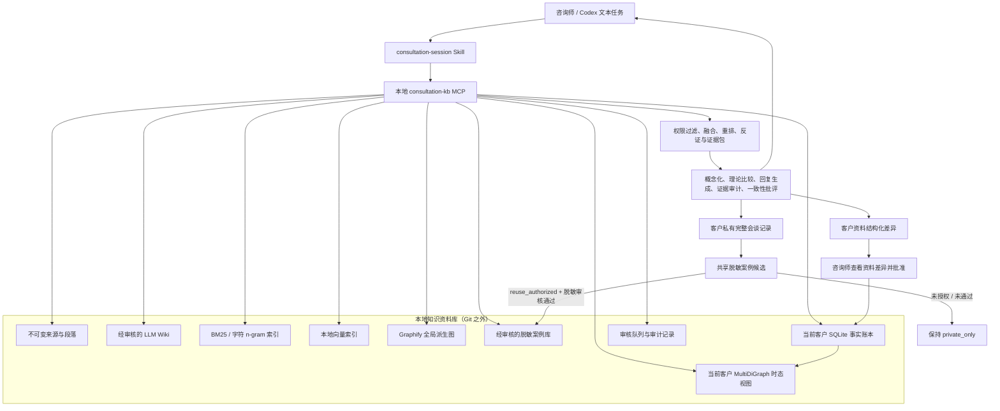
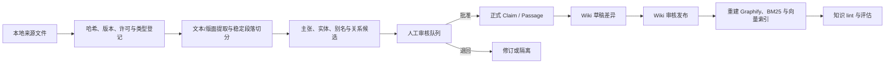

# 面向国学、情感咨询与生涯规划的质量优先知识库系统设计

> 状态：已批准，待实现
> 版本：1.0
> 日期：2026-07-16
> 设计基线：Graphify `v4`，提交 `e441454c55ee3e47047e82e8b50c212d38ed2922`
> 实现载体：Codex 项目 + 本地统一 MCP 服务 + 本地知识资料库
> 第一阶段使用者：单一专业咨询师

## 1. 执行结论

本系统采用质量优先的分层混合架构：

1. 本地不可变原始证据层保存真正可核验的来源；
2. 经人工审核的 Karpathy 风格 LLM Wiki 保存稳定、可持续修订的知识综合；
3. 中文词法检索与本地向量检索共同承担精确召回和语义召回；
4. Graphify 作为可重建的全局关系图与结构导航层；
5. 每位来访者拥有物理隔离的事实账本和时态图，用于跨次咨询连续性；
6. 完整会谈记录先保存在客户私有目录；只有具备复用授权且通过脱敏审核的派生版本才进入共享案例库，并在服务其来源来访者时于模型调用前排除；
7. 回答由分析、检索、生成、证据审计和一致性批评等多阶段共同完成；
8. 每次咨询结束生成两份待审核归档：客户私有完整会谈记录和客户资料结构化变更；共享脱敏案例是从前者产生、独立审核且不阻塞资料更新的条件分支；
9. 任何长期知识、客户资料或共享案例的激活都必须先显示差异并由咨询师批准；实际会谈记录按轮保存，但不能由模型回答直接反哺正式知识。

传统 RAG 不是被 Graphify 或 LLM Wiki 取代，而是系统不可缺少的一层。词法检索负责古籍原句、专名和精确术语，向量检索负责改写、隐含主题和近似案例，Wiki 负责稳定综合，图谱负责关系与依赖，时态客户图负责当前事实与历史演变。任何单一检索器都不是权威来源。

第一阶段直接在 Codex 中使用，不建设独立 Web、移动端或 API 服务。输入和输出均为文本，一个咨询任务对应一个 Codex 上下文窗口。没有强制响应时延或严格上线门槛；在满足客户隔离、来源客户案例排除、有效事实和审核写回等硬约束后，以回答质量最大化为最高目标。

## 2. 背景与设计目标

### 2.1 业务背景

知识内容主要包括：

- 中国传统文化与国学原典、注疏、历史语境及现代解释；
- 情感咨询和心理支持相关理论、方法与实践材料；
- 生涯规划理论、职业信息、决策方法和行动框架；
- 咨询过程记录、来访者长期资料和经审核的脱敏案例。

系统既要即时分析来访者问题，又要生成可直接使用的回应、后续引导和行动建议。理论可以被灵活调用，但不要求机械引用原文，也不要求每次回答都展示学派术语；当咨询师自创并批准的 C1 理论适用时，它是所有资料中的最高咨询框架来源。对外回答应自然；对内必须能追溯关键判断所依据的事实、证据、反证、限制条件和不确定性。

### 2.2 第一阶段目标

- 在 Codex 中完成从“开始咨询”到“结束归档”的完整文本工作流；
- 使用客户当前资料和历史变化维持跨次咨询的一致性；
- 综合 Wiki、词法 RAG、向量 RAG、全局图谱和案例，最大化回答质量；
- 生成多个核心结论一致但表达策略不同的来访者可用回复；
- 明确区分来源事实、来访者陈述、咨询师观察、模型假设和建议；
- 让所有关键知识主张可回到本地原始来源或正式客户记录；
- 通过确定性过滤防止跨客户泄漏和来源客户案例自我举例；
- 通过审核、版本化和可回滚写入保持知识库和客户资料不被模型污染；
- 建立可复现的质量评估体系，比较不同检索与生成组合。

### 2.3 明确不在第一阶段范围内

- 独立 Web 或移动应用；
- 面向其他系统的生产 API 服务；
- 语音、转写、微信或其他渠道接入；
- 多用户、复杂角色权限或组织级平台；
- 固定响应时间 SLA；
- 自动抓取互联网内容并写入知识库；
- 自动心理诊断、治疗决策或强制处置；
- 未经人工审核的知识、案例或客户资料写回；
- 面向来访者展示的自动危机标签或告警系统。

## 3. 最高原则与不可破坏约束

### 3.1 质量优先级

质量按以下顺序理解：

1. 事实与客户状态正确；
2. 关键判断有证据，且证据被如实解释；
3. 不把假设伪装成事实，不隐藏重要反证或来源冲突；
4. 回应对咨询目标专业、有帮助、可执行，并维护来访者自主性；
5. 当前回答、多个回复版本、同次咨询和跨次咨询之间保持可解释的一致；
6. 在前述条件满足后再优化文风、速度和资源成本。

Token 消耗和响应时间是次要约束。系统允许多路检索、重排、多角色推理和有限次数重试，但重试必须有上限；证据仍不足时应明确说明不足或冲突，不能为了追求流畅而编造确定性。

### 3.2 四项运行时硬约束

无论是否设置正式上线门槛，以下约束都必须由代码和存储边界保证，不能只依赖 Prompt：

1. **客户隔离**：客户私有账本、资料、时态图和会谈文件按客户分库、分目录保存；会谈运行时由不可伪造的会话能力只打开当前客户的数据根和数据库，生成侧工具不能指定任意客户或文件路径。
2. **来源客户案例排除**：不仅案例文本，任何由案例派生的主张、模式、Wiki 段落、图边和索引块都必须保存传递性来源谱系；模型看到候选内容前，排除包含当前客户贡献且无法生成合格 leave-one-client-out 版本的对象。
3. **有效且获准的事实**：正式回答只能将当前有效且权限允许的长期客户事实当作长期事实使用；本次来访者新陈述可以按 `session-scoped client_reported` 使用，但不能冒充已审核客观事实或自动提升为长期资料。草稿、已失效、已解决、被取代或未批准内容不得静默混入。
4. **审核后写回**：共享案例候选、客户资料变更、Wiki 更新和跨案例模式均先成为草稿，展示差异后由咨询师批准；私有实际会谈记录按轮保存，但其后续用途仍受审核决定约束。

### 3.3 不矛盾原则

系统的最高表达原则不是“永远不改变结论”，而是“不出现无解释的前后矛盾”。当新证据促使结论改变时，对内必须记录：

- 旧结论；
- 新信息；
- 结论改变的理由；
- 对建议、客户资料或后续观察的影响。

对外是否展开变化过程由咨询场景决定，但不得在同一回复的多个版本中给出相互冲突的核心判断。

## 4. 使用边界与运行假设

### 4.1 使用者与交互

- 第一阶段仅供一名专业咨询师内部使用；
- 正常文本输入，正常文本输出；
- 一个咨询任务只服务一位来访者的一次咨询；
- 每次咨询开启一个新的 Codex 任务/上下文窗口；
- 客户通过稳定的别名或 `client_id` 标识，不在任务中使用真实姓名；
- 系统不负责来访者入口、身份验证、支付或消息投递。

### 4.2 数据进入模型的前提

第一阶段假定使用 Personal/Plus/Pro 类 ChatGPT 账户中的 Codex，可使用其托管模型分析已去标识化文本。直接粘贴到 Codex 编辑器的内容已经发生外部处理，因此去标识化必须发生在提交之前；提交后的扫描只能告警，不能撤销已经发生的数据传输。

由于第一阶段只设计普通文本输入，不另建本地录入界面，“粘贴前已经去标识化”是明确的人工运营前提，而不是本系统能自动证明的硬约束。若未来需要自动预检，必须在文本进入 Codex 之前增加独立本地入口；在 Codex 内运行的 Skill 或 MCP 只能发现问题并阻止后续归档，不能收回已经发送的正文。

建议进行一次性设置：

- 关闭“Improve the model for everyone”；
- 在咨询任务中关闭 Codex Memories；
- 关闭 Chronicle；
- 始终使用客户别名或 `client_id`；
- 将正式知识和客户资料保留在本地资料库。

这些设置不应在每次咨询前反复打断工作流。适用的告知、同意、保存期限和法律义务由实际运营者负责，本设计不试图绕过这些义务。

### 4.3 资料来源边界

运行时知识只来自用户明确放入本地资料库的文件，不自动联网抓取、更新或写回。职业政策、资格要求、市场数据等高时效内容必须带有复核日期和过期状态；当本地资料过期时，系统提示“资料可能陈旧”，而不是自行联网补全。

本设计文档本身可以引用互联网官方文档和上游项目资料，以解释设计依据；这不代表运行时会自动采集互联网内容。

## 5. 总体架构



### 5.1 各层职责

| 层 | 核心职责 | 不能承担 |
|---|---|---|
| 原始证据层 | 保存原文、版本、页码/段落、哈希和来源许可；作为最终证据锚点 | 不直接把所有内容无差别塞入模型 |
| LLM Wiki | 保存经审核的稳定综合、理论比较、适用边界、争议和引用 | 不能反过来成为其自身主张的原始证据 |
| 词法 RAG | 原句、专名、古汉语词组、精确术语和引用位置召回 | 不能理解所有隐含语义 |
| 向量 RAG | 改写、相近情绪主题、概念近似和类似情境召回 | 不能越过元数据权限，也不能证明相似即适用 |
| Graphify 全局图 | 关系发现、社区、跨领域导航、依赖路径和知识缺口 | 不能充当权威事实层或最终回答引擎 |
| 客户事实账本 | 保存经审核、带时间和版本的客户事实事件；作为客户资料真相源 | 不用于其他客户的案例示例 |
| 客户时态图 | 从事实账本物化关系、依赖、失效影响和历史变化 | 不能替代事务账本或单独决定间接失效 |
| 案例库 | 保存经脱敏审核的完整会谈轨迹，供其他客户的相似案例参考 | 不能向来源客户召回自身案例，不能把单例当普遍规律 |
| 生成与批评层 | 综合证据、生成多个版本、审计支持度和一致性 | 不能绕过过滤器直接访问未批准资料 |
| 审核与审计层 | 管理草稿、差异、批准、回滚、删除和复现 | 不能用“模型高置信度”替代人工决定 |

### 5.2 权威层与派生层

以下内容是不可替代的源记录或治理事件，必须可保留、审计和版本化：

- 用户放入资料库的原始来源文件及其段落；
- 实际发生的、已经去标识化的咨询对话；它证明该轮对话发生，但其中的来访者表述仍是“陈述”，不自动成为客观事实；
- 经审核的客户事实账本事件；
- 咨询师的审核、批准、纠正和删除决定。

这里的“不可变”指在正常保留期内只追加新版本、不静默覆盖旧内容，并不意味着可以拒绝合法删除。删除请求通过 tombstone 立即停用，随后按第 18 节完成物理清理并留下最小非内容审计证明。

以下内容均为可重建派生物：

- Wiki 渲染页面；获准的 Wiki 修订事件本身属于治理记录，不能丢失；
- 全局 Graphify 图和客户时态图 JSON；
- BM25、字符 n-gram 和向量索引；
- 客户当前资料的 Markdown/JSON 物化视图；
- 未采用的模型候选回答、案例模式候选和评估结果。实际发送回复属于会谈源记录。

派生物损坏时必须由源事实重建，不得把已损坏派生物提升为真相源。

## 6. Git 仓库与本地资料库布局

### 6.1 Git 仓库

本仓库只保存代码、规则、Schema、测试和文档，不保存任何真实客户内容：

```text
graphify/
├─ AGENTS.md
├─ .codex/
│  └─ config.toml
├─ .agents/
│  └─ skills/
│     ├─ consultation-session/SKILL.md
│     ├─ knowledge-curator/SKILL.md
│     └─ quality-evaluator/SKILL.md
├─ graphify/                    # 尽量保持上游兼容的原项目
├─ consultation_kb/            # 新的适配、检索、账本、MCP 与事务层
├─ schemas/
├─ policies/
├─ tests/
└─ docs/
```

实现时应通过适配器调用 Graphify，尽量避免将客户专用时态语义直接侵入上游核心。若必须修改 Graphify 核心，变更应保持通用性并附回归测试。

### 6.2 Git 之外的本地资料库

建议使用仓库同级目录：

```text
<ABSOLUTE_VAULT_ROOT>\
├─ identity/
│  └─ identity-map.enc
├─ sources/
├─ wiki/
│  ├─ draft/
│  ├─ approved/
│  └─ history/
├─ global/
│  ├─ catalog.sqlite3
│  ├─ graph/graph.json
│  └─ indexes/
│     ├─ bm25/
│     └─ vector/
├─ cases/
│  ├─ draft/
│  ├─ approved/
│  └─ quarantine/
├─ clients/
│  └─ <client_id>/
│     ├─ client.sqlite3
│     ├─ profile/
│     │  ├─ current.json
│     │  ├─ current.md
│     │  └─ history/
│     ├─ graph/
│     │  └─ temporal.json
│     └─ sessions/
│        └─ <session_id>/
├─ review-queue/
├─ audit/
└─ quarantine/
```

`identity-map.enc` 是客户真实身份与别名之间的独立加密映射。日常知识查询和咨询流程不应需要读取该文件。每个客户只有一个独立数据库和目录；系统不建立包含所有客户原始事实的共享客户图。

### 6.3 客户存储与运行时隔离

“一个统一 MCP 服务”只表示 Codex 配置一个控制面端点，不表示一个生成侧查询进程可以任意浏览全部客户。开始会谈时：

1. 控制面验证所选 `client_id`，创建绑定 `session_id`、客户、只读/写权限和到期时间的服务端 capability；
2. 为本次会谈启动客户作用域 worker，只向它提供当前客户数据库和根目录的已解析句柄；
3. 后续客户工具只接收不透明 `session_handle`，不接受 `client_id`、绝对路径或任意相对路径；
4. 路径解析必须拒绝 `..`、绝对路径、符号链接、junction/reparse point 和硬链接逃逸；
5. worker 不得枚举 `clients/`，共享日志、全局图和索引不得包含客户正文；
6. 会谈结束或 capability 到期后关闭句柄并销毁 worker 的客户状态。

每客户分库、分目录是静态物理分离；会话 capability 和作用域 worker 是运行时确定性隔离。若实现环境不能限制 worker 只访问一个客户根目录，则必须明确降级为“逻辑隔离”并不得声称已满足本设计的客户隔离硬约束。

本机存储基线采用 NTFS ACL 限制资料库只对当前操作账户可读，并建议资料库所在卷启用 BitLocker；`identity-map.enc` 的密钥由 Windows DPAPI 保护，备份必须单独加密。第一阶段不把“自研加密格式”作为前提；若未来需要不同操作者或更强的每客户静态密码学隔离，再引入 SQLCipher/每客户数据密钥。该选择不改变分库、作用域 worker 和检索隔离要求。

## 7. 核心知识模型

### 7.1 最小证据链

所有进入正式回答的关键内容都必须有一条与其类型匹配的来源链；Wiki 是可选综合节点，不是所有证据的必经节点：

```text
知识来源：Source → Passage → Claim → Concept / Theory / Method → [WikiPage] → Answer
咨询师 C1：ConsultantTheorySource → TheoryRevision → Passage → Claim → Theory / Method → Answer
客户事实：Session → Turn / Statement / Observation → FactEvent → [ProfileRevision] → Answer
案例来源：PrivateSessionRecord → DeidentifiedCase → [CasePattern] → Answer
```

`Claim`（主张）是一等实体，不能只把整篇文档和概念节点相连。这样才能表示“谁在什么位置提出了什么”“哪些证据支持或反对”“适用范围是什么”。

### 7.2 全局节点类型

- `Source`：文件、版本、作者、许可、哈希和采集信息；
- `Passage`：可精确定位的原文片段；
- `Claim`：可支持、反驳、审核和失效的原子主张；
- `Concept`：概念或构念；
- `Theory`：国学学派、咨询理论或生涯理论；C1 还必须指向咨询师批准的 `TheoryRevision`；
- `Method`：分析、提问、干预或规划方法；
- `RiskRule`：内部风险观察和人工介入规则；
- `CareerItem`：职业、资格、市场数据或政策项目；
- `Case`：经审核的完整脱敏案例；
- `CasePattern`：跨案例、人工审核后的抽象模式；
- `WikiPage`：稳定综合页面。

### 7.3 全局关系类型

- `CITES`
- `SUPPORTS`
- `CONTRADICTS`
- `INTERPRETS`
- `DERIVED_FROM`
- `APPLIES_TO`
- `NOT_APPLICABLE_TO`
- `ANALOGOUS_TO`
- `DISTINCT_FROM`
- `CONTRAINDICATED_FOR`
- `REQUIRES_REFERRAL`
- `EXEMPLIFIED_BY`
- `SUPERSEDES`

国学与现代咨询理论之间默认只能建立 `ANALOGOUS_TO`、`DISTINCT_FROM` 或带条件的 `APPLIES_TO`，不得未经证据标记为等同或因果。例如“无为”和“接纳”可以比较，但不能宣称二者本质相同；传统文化概念可以帮助理解文化语境，但不能作为精神障碍诊断依据。

### 7.4 元数据必须分轴保存

节点、关系和主张至少分别保存以下轴，不能把它们压缩为一个 `confidence`：

| 元数据轴 | 示例 |
|---|---|
| 来源与位置 | `source_id`、版本、页码、段落、哈希 |
| 认知类型 | 事实、来访者陈述、咨询师观察、解释、假设、建议 |
| 来源/证据等级 | T1-T4、C1-C6、K1-K4、L1-L4 |
| 咨询框架优先级 | `highest`（适用的 active C1）、`normal`、`not_applicable` |
| 外部实证状态 `empirical_support` | 未评估、案例支持、观察支持、实证支持、指南一致、存在冲突 |
| 模型置信度 | 抽取或推断模型的校准分值 |
| 人工审核状态 | draft、reviewed、approved、rejected |
| 时间有效性 | `effective_from`、`effective_to`、观测时间、复核日期 |
| 适用性 | 人群、文化语境、条件、反例、禁忌 |
| 隐私与用途 | 敏感级别、作用域、允许用途、删除状态 |
| 案例来源谱系 | 受控目录中的 `provenance_case_ids`、`provenance_client_ids` 和派生规则 |

模型置信度只说明模型对其抽取或推断的把握，不等于证据强，也不等于人工批准。

案例来源谱系按派生关系做传递闭包：若一个模式引用三个案例，Wiki 主张又引用该模式，则主张继承三个案例和三个来源客户。来源客户标识只保存在受控 catalog 元数据中，不写入案例正文、Wiki 正文、向量文本或对外输出。

### 7.5 全局目录的最小逻辑表

`global/catalog.sqlite3` 至少包含以下逻辑表，具体列和索引在实现计划中细化：

- `sources`：来源版本、哈希、许可、领域和敏感级别；
- `passages`：稳定段落、原文位置和上下文边界；
- `claims`：原子主张、认知类型、适用范围和当前状态；
- `claim_evidence`：主张与支持、反对段落的多对多关系；
- `theory_revisions`：C1 理论文档哈希、版本、作者、批准事件、适用范围、`framework_priority`、`empirical_support`、有效期和取代链；
- `entity_aliases`：中文别名、古今词义和规范化实体；
- `review_decisions`：审核对象、差异、决定、时间和版本；
- `wiki_revisions`：Wiki 页面版本及其主张集合；
- `artifact_versions`：图和各类索引对应的源目录版本；
- `tombstones`：立即禁止检索的对象与清理状态。

全局目录记录知识治理状态，但原始文件及其内容哈希仍是来源证据；目录损坏时可由原始文件、审核记录和 Wiki 历史恢复。

## 8. 分领域来源与证据等级

适用的 active C1 具有跨领域、全资料最高的咨询框架优先级；除此以外，国学原文、外部研究、案例和职业事实仍按各自尺度评估，不能把它们的外部证据强度压成一个统一排行榜。

### 8.1 国学与历史解释

| 等级 | 含义 |
|---|---|
| T1 | 原典或可靠校勘版本 |
| T2 | 权威注疏、学术专著或同行评议研究 |
| T3 | 有明确出处的当代解释 |
| T4 | 跨理论类比或模型综合 |

T4 可以用于启发或表达，但不能倒过来证明原典“本来就是这个意思”。原文、注疏和现代应用应分别标记。

### 8.2 咨询与心理支持

咨询领域的 C 等级首先表达“本咨询系统采用何种理论来源作为回答框架”。咨询师自创并确认的理论是本系统所有资料中的最高级别来源：

| 等级 | 含义 |
|---|---|
| C1 | 咨询师自创并正式确认的理论、原则和方法；本系统所有资料中的最高级别来源 |
| C2 | 官方指南、系统综述、Meta 分析 |
| C3 | 同行评议实证研究 |
| C4 | 公认教材或专业共识 |
| C5 | 其他专家经验、单个案例或内部实践总结 |
| C6 | 模型生成、尚待验证的假设 |

当适用范围匹配时，检索、重排、概念化和回复生成应优先使用 C1 作为主框架；这一优先级高于 T、C2-C6、K 和 L 各类资料。其他资料用于补充、验证、比较、提出边界或显示冲突，不能静默取代 C1。只有咨询师本人可以创建、批准、修订或废止 C1；模型只能提出修订建议。每个 C1 版本必须保存作者、版本、批准时间、有效期、适用范围、核心命题、方法、禁忌、反例、与旧版本的取代关系及其引用来源。

“C1 是最高级别来源”表示它在本咨询系统的分析框架、解释路径和建议生成中具有最高理论权威，不等于把外部材料改写成支持 C1，也不等于自动宣称 C1 已获得最高等级的外部科学验证。因此 `source_grade=C1` 与 `empirical_support` 必须分别记录：系统忠实采用咨询师理论，同时如实说明它有哪些案例、观察、研究或指南支持，哪些部分尚未验证或与外部材料冲突。T1 仍决定古籍原文究竟写了什么，L1 仍决定当前官方政策究竟规定了什么；但如何把这些材料用于咨询分析与建议，以适用的 C1 为最高框架。法律边界、客户隔离、来源客户案例排除及其他确定性硬约束不属于来源等级竞争，任何理论等级都不能覆盖这些约束。

### 8.3 咨询案例

| 等级 | 含义 |
|---|---|
| K1 | 同期形成的直接记录，只证明当时的陈述或记录 |
| K2 | 咨询师的结构化摘要 |
| K3 | 多个去标识化案例形成并经人工审核的模式 |
| K4 | 合成或教学案例 |

某个案例中一次方法有效，不能自动成为对同类来访者普遍有效的证据。

### 8.4 生涯与职业信息

| 等级 | 含义 |
|---|---|
| L1 | 当前官方统计、法规、资格要求 |
| L2 | 专业机构或高质量行业调查 |
| L3 | 企业招聘、市场观察 |
| L4 | 个体经验或模型推断 |

L1-L3 必须保存观测时间、适用地区和复核日期；过期后仍可作为历史资料，但不能在回答中伪装成当前事实。

## 9. 客户事实账本与时态图

### 9.1 为什么需要两层

客户资料既需要事务安全和完整历史，又需要图关系和边效应分析。Graphify/NetworkX 图适合做关系视图，却不适合单独承担事务真相源。因此采用：

- 每客户一个 SQLite 事件/事实账本，保存不可覆盖的事实版本、审核决定和原子事务；
- 从账本生成一个 NetworkX `MultiDiGraph` 时态关系视图，供依赖查询、变化传播和解释使用。

客户图使用与 Graphify 相同的 NetworkX 图技术和派生图思想，但其 `MultiDiGraph` 物化器、时态过滤、加权路径和查询器由 `consultation_kb` 新实现。上游 Graphify 当前查询器按单边 `Graph/DiGraph` 设计，未经专门适配和回归测试，不得直接用于客户时态图。

### 9.2 客户时态节点

- `Client`
- `Session`
- `PersonRole`
- `Event`
- `Statement`
- `Observation`
- `Hypothesis`
- `Goal`
- `Issue`
- `Intervention`
- `Outcome`
- `Preference`

### 9.3 客户时态关系

- `ABOUT_ENTITY`
- `DEPENDS_ON`
- `DERIVED_FROM`
- `SUPPORTS`
- `CONTRADICTS`
- `SUPERSEDES`
- `RESOLVED_BY`
- `CURRENT_RELATIONSHIP`
- `HISTORICAL_RELATIONSHIP`

使用 `MultiDiGraph` 是为了允许同一对节点间存在多条不同时间、来源和类型的边，避免后写属性覆盖先前证据。

### 9.4 客户事实字段

每条事实或关系至少包含：

- 全局唯一 `fact_id` 或 `edge_id`；
- `client_id` 与 `source_session_id`；
- 主体、谓词、客体或规范化值；
- 认知类型；
- 业务有效时间 `effective_from`、`effective_to`，以及时间精度和时区；
- 系统时间 `recorded_at`、`approved_at`、`transaction_id`、`commit_version`；
- 根据认知类型保存 `reported_at` 或 `observed_at`；
- `review_status`：`proposed`、`reviewed`、`approved`、`rejected`；
- `validity_status`：`active`、`superseded`、`invalidated`、`historical`；
- `resolution_status`：`open`、`resolved`、`not_applicable`；
- `epistemic_status`：`asserted`、`uncertain`、`disputed`；
- 事实置信度；
- 审核人、审核理由和审核来源；
- 来源对话锚点；
- 对其他事实的依赖边；
- 隐私与允许用途；
- `supersedes_event_id`、前一版本和替代版本引用。

业务有效时间回答“事情何时成立”，系统时间回答“系统何时知道并批准它”。例如今天才得知两周前已经分手，`effective_from` 可以是两周前，`recorded_at` 是今天；历史快照必须能同时按两个时间轴复现。

### 9.5 客户数据库的最小逻辑表

每个 `client.sqlite3` 至少包含：

- `sessions`：会谈状态、客户快照版本、开始/结束时间；
- `turns`：实际来访者消息、候选回复引用和处理状态；
- `actual_replies`：咨询师实际采用或修改后的回复；
- `session_fact_events`：本次会谈临时事实和纠正；
- `fact_events`：经审核的长期事实版本事件；
- `fact_dependencies`：直接和间接依赖、来源与置信度；
- `profile_revisions`：当前资料物化版本及其来源事件；
- `archive_bundles`：私有会谈关闭、客户资料差异和共享案例候选的关联清单，各发布目的拥有独立状态；
- `review_decisions`：批准、修改、拒绝和回滚记录；
- `tombstones`：立即禁止检索的客户对象。

数据库中的每个事实变化以事件追加，`profile/current.json` 和 `profile/current.md` 只是从获准事件生成的当前视图。

### 9.6 更新操作

客户资料变更必须归类为以下原子操作：

- `ADD`：新增事实；
- `CONFIRM`：增加已有事实的支持证据或置信度；
- `CORRECT`：纠正值或时间；
- `SUPERSEDE`：新事实取代旧事实；
- `RESOLVE`：事项已经解决，不再属于当前待处理状态；
- `MERGE`：合并重复表达但保留来源链。

当前资料视图只显示仍相关、当前有效且获准的综合结果。已解决、失效、被取代和重复信息从当前视图移除，但保留在历史账本中，不做静默物理删除。

`MERGE` 先按实体、谓词、规范化值、时间范围和作用域形成规范化键，再把语义相近项作为候选交给审核。合并只统一当前物化视图，各原始陈述、时间、来源和冲突状态仍分别保留；内容相似但互相冲突的陈述不得为了“去重”被强行合并。

### 9.7 边效应与置信度传播

以“来访者更换男朋友”为例：

1. 关闭旧 `CURRENT_RELATIONSHIP` 边，设置 `effective_to`，并物化为历史关系；
2. 新建当前伴侣关系；
3. 所有直接依赖“旧伴侣仍是当前伴侣”的事实和建议被自动提出失效或取代；
4. 与旧伴侣相关但仍有历史解释价值的事件保留为历史；
5. 更一般的依恋、沟通或选择模式不能自动删除，只降低置信度或进入复核队列；
6. 更新提案向咨询师展示受影响节点、依赖路径、旧值、新值和建议操作。

直接、确定性的依赖失效可以自动生成提案；间接、推断性的影响只能标为“需要复核”。系统不得因图上存在路径就自动改写所有相连结论。

### 9.8 索引同步

审核状态、证据等级、权限、有效期等仅元数据变化，也必须使相关 Wiki、图、BM25 和向量索引失效并触发局部重建。当前 Graphify 缓存忽略 Markdown frontmatter 变化的行为不能用于正式客户或知识治理。

## 10. 知识入库与持续整理

### 10.1 入库状态机

用户将本地文件放入 `knowledge-vault/sources/` 后，知识整理流程如下：



每个来源必须保存内容哈希、文件版本、导入时间、文档类型、使用许可、语言、领域和敏感级别。原始文件不得被提取或整理过程覆盖；修订版作为新版本进入。

### 10.2 文档切分原则

- 古籍：按作品、版本、卷/篇、章句和稳定行文位置切分，同时保留上下文窗口；
- 注疏与论文：保留作者、页码、章节和引用关系；
- 咨询方法资料：把理论定义、适用条件、禁忌、步骤和证据分别切为主张；
- 职业资料：把时间、地区、统计口径、资格要求和政策版本纳入段落元数据；
- 案例：按会谈、轮次、事件和干预轨迹切分，但原始案例与共享知识保持独立作用域。

切分不能只按固定 Token 数量破坏古文篇章、论证链或咨询对话次序。检索时可返回原子段落，也应能向前后扩展上下文。

### 10.3 主张抽取与审核

模型抽取出的 `Claim` 初始只能是 `draft`，并明确标记抽取类型：

- 原文明示；
- 对原文的转述；
- 咨询师人工判断；
- 模型推断；
- 跨理论类比。

审核界面至少展示原文片段、上下文、精确位置、拟议主张、证据等级、关系类型、适用范围和冲突候选。未经审核的模型推断不得参与正式回答。

C1 不通过普通“模型抽取后自动定级”产生。咨询师自创理论以正式本地文档进入 `sources/consultant-theory/`，保存全文内容哈希和稳定 `Passage` 锚点；每次修改创建新的 `TheoryRevision`，旧版本只通过 `SUPERSEDES` 关系退出 active。模型可以帮助整理文档、提取命题或提出修订草稿，但只有咨询师通过不可伪造的显式批准才能把版本创建、修改、废止或定级为 C1。未批准、过期或被取代版本不得进入正式检索。

### 10.4 LLM Wiki 的定位

LLM Wiki 是“经审核、可修订的知识编译层”，不是 Graphify 当前 Wiki 导出的节点清单。一个正式 Wiki 页面应包含：

- 稳定概念定义；
- 历史语境或理论背景；
- 不同解释及各自来源；
- 适用条件、边界、禁忌和反例；
- 与其他概念的关系；
- 支持主张和反对主张；
- 引用到 `Passage` 的锚点；
- 审核状态、更新时间和复核日期；
- 未解决问题和待补证据。

新增资料不是简单追加到 Wiki 尾部，而是对既有主题页进行差异化修订：补充、纠正、分歧并列、取代或标记过期。所有发布版本保留历史和回滚点。

### 10.5 知识 lint

每次发布和定期维护至少检查：

- 无原始来源支持的正式主张；C1 的原始来源是咨询师正式理论文档及其 `TheoryRevision`/`Passage` 锚点；
- 主张来源已经更新但 Wiki 尚未复核；
- 互相矛盾但未在 Wiki 中说明的主张；
- 无入口、无引用的孤立页面；
- 仅引用模型回答或 Wiki 自身的循环证据；
- 模型推断被错误标记为原文明示；
- 模型或其他资料被错误提升为 C1，或 C1 缺少咨询师批准、版本、适用范围和取代关系；
- 已废止或被取代的 C1 仍进入 active Wiki、图或索引；
- C1 的 `source_grade` 与外部 `empirical_support` 被混写，导致“内部最高权威”被误称为“外部最高实证”；
- 健康、法律、职业资格和市场资料超过复核日期；
- 案例模式只由一个案例支撑；
- 关系缺少适用范围、来源或审核状态；
- 元数据变化后派生索引版本不一致。

模型回答不能引用自身作为证据。优质回答和跨案例模式只能进入候选队列，不能自动写入正式 Wiki。

## 11. 单次咨询工作流

### 11.1 会谈开始

咨询师输入：

```text
开始咨询 client_0042
```

`consultation-session` Skill 调用 MCP 的 `load_client_context`。MCP 只挂载 `clients/client_0042/`，返回：

- 最新获准的客户综合资料；
- 最近会谈摘要；
- 尚未解决的事项；
- 当前目标、偏好和约束；
- 关键事实的来源、时间和置信度；
- 需要关注的冲突、过期或待复核项。

较早的客户私有历史不会全部塞进上下文，只在问题相关时从该客户自己的账本和时态图按需召回。加载结果必须带快照版本，保证本次会谈使用的资料可复现。

### 11.2 会谈中的双轨状态

正式客户资料在本次咨询中只读，以避免对话中途的未经审核信息改变后续检索。系统同时维护一个临时 `session_fact_ledger`，记录：

- 新事实；
- 对旧事实的纠正；
- 可能失效的事项；
- 新的目标、问题、偏好和约束；
- 尚不确定的假设；
- 与当前资料的冲突。

临时账本可以影响本次会谈后续分析，但必须明确区分“本次新陈述”和“已审核长期事实”。会谈结束前不会写入正式客户数据库。

### 11.3 每轮输入的处理

每条来访者消息经过以下步骤：

1. 识别当前问题、情绪、需求、目标和可能的事实变化；
2. 更新临时事实账本；
3. 将问题拆成客户事实、理论方法、历史变化、案例类比、反证与风险观察等子查询；
4. 并行执行客户私有检索和全局知识检索；
5. 先过滤权限、有效性、自案例和未批准内容；
6. 融合、重排并生成证据包；
7. 多阶段生成内部分析和多个来访者可用回复；
8. 独立审计证据、一致性和内部风险；
9. 向咨询师返回最终结果。

### 11.4 每轮输出契约

系统返回四类内容：

1. **咨询师内部分析**：问题概念化、关键情绪/需求、事实与假设、可能的理论解释、反证和不确定性；
2. **多个来访者可用回复**：例如温和共情版、直接澄清版、探索引导版；表达策略不同，但核心结论一致；
3. **后续问题与引导**：建议追问、可选行动、观察重点和下一步；
4. **内部依据与质量信息**：关键来源、证据等级、冲突、客户事实版本、风险观察和本轮运行标识。

来访者可用回复默认自然、无引用标记，也不输出任何风险告警标签。咨询师需要时可以展开来源和审计详情。

### 11.5 记录实际采用的回复

模型生成的多个候选回复都只是草稿。咨询师应通过以下任一方式标记实际回复：

```text
采用版本 2
```

或：

```text
采用版本 2，实际回复修改为：……
```

只有实际采用或实际粘贴的文字进入正式会谈对话。未采用版本不被视为实际咨询内容，不能据此推断来访者收到过什么干预，也不能成为客户资料更新的事实依据。

每轮必须遵循状态机：

```text
client_turn_received
→ candidates_generated
→ awaiting_actual_reply
→ actual_reply_recorded / external_reply_unknown
→ turn_closed
```

下一条来访者消息到达前，上一轮必须关闭。若尚未记录，系统提示咨询师选择候选、粘贴实际修改稿，或明确记录“在系统外回复，内容未知”；不得默认任何候选已经发送。`actual_replies` 保存幂等 `turn_id`、`sent_at`、来源类型（直接采用、编辑后采用、外部未知）和内容哈希。`external_reply_unknown` 允许继续咨询，但后续因果分析和归档必须明确标记该缺口。

## 12. 检索、融合与证据包

### 12.1 查询分解

查询规划器把每轮问题拆为若干可追踪子查询：

- 当前客户事实；
- 情绪、需要和关系动力；
- 事实的历史变化和未解决事项；
- 相关理论、方法、边界和反例；
- 适用的脱敏案例或案例模式；
- 反证、替代解释和冲突来源；
- 内部风险观察和需要咨询师介入的条件。

系统不要求每个问题都调用所有检索器。检索规划器根据子查询类型选择路由，但关键客户事实、权限过滤和来源客户案例排除始终执行。

### 12.2 并行检索通道

1. 当前客户综合资料；
2. 当前客户 SQLite 历史和时态图；
3. 获准的 LLM Wiki；
4. 中文 BM25、词组和字符 n-gram；
5. 本地中文/多语言向量索引；
6. Graphify 全局图和加权路径；
7. 获准的完整脱敏案例与案例模式。

词法和向量检索必须支持元数据预过滤。禁止先把所有候选文本发送给模型再靠 Prompt 删除不应访问的内容。

### 12.3 确定性预过滤

候选内容进入融合器前必须通过：

- 客户作用域；
- 使用权限和允许用途；
- `approved` 审核状态；
- 时间有效性和删除 tombstone；
- 来源新鲜度要求；
- 案例及所有案例派生对象的传递性 `provenance_client_ids` 不得包含当前客户，除非存在经审核且不含当前客户贡献的 leave-one-client-out 版本；
- 当前任务允许的数据敏感级别。

该规则统一应用于 `Case`、`CasePattern`、案例派生 `Claim`、Wiki 段落、Graphify 节点/边、BM25/字符块、向量块和重排候选。若一个多客户模式包含当前客户贡献，系统优先使用预计算或按需生成的 leave-one-client-out 版本；剩余来源数、证据等级或审核状态不再达标时整项排除。若一个知识主张另有完全独立的典籍、论文或非当前客户案例证据，只保留独立证据支持的版本。

“来源客户案例排除”不排除该客户自己的私有会谈历史。客户私有历史用于维持连续性，作用域始终是 `client_private_history`，不得作为“别人也经历过”的案例向本人举例，也不得转成全局案例证据。相同的来源谱系还用于撤回和删除传播测试。

### 12.4 融合与重排

建议采用以下质量优先顺序：

1. 每个检索器内部产生有解释的候选分数；
2. 使用 Reciprocal Rank Fusion 或同类稳健方法合并候选；
3. 使用本地交叉编码器或重排模型评估语义相关性；
4. 先执行适用范围门控；存在适用且 active 的 C1 时，把它提升为跨 T/C/K/L 资料的最高咨询框架；
5. 再根据审核状态、时效、客户事实直接性和各领域自身的证据等级排列其他资料；
6. 去重但保留不同来源的独立支持；
7. 强制保留足够的反证、替代解释和来源多样性，外部冲突不能因 C1 优先而被删除；
8. 控制上下文预算，优先保留可核验的关键段落而非冗长摘要。

向量模型、重排模型和向量存储均为可替换组件。默认模型不凭营销材料硬编码，而是在本系统金标准集上对候选中文/多语言模型做离线基准后确定。第一阶段使用本地模型，因此不需要另行调用 OpenAI API。

### 12.5 图路径评分

不能使用朴素无权最短路径直接支持咨询结论。路径代价至少考虑：

- 边是原文抽取、人工判断还是模型推断；
- 边置信度；
- 支持它的证据等级和独立来源数；
- 人工审核状态；
- 时间有效性和复核时间；
- 对当前来访者和问题的适用性；
- 路径长度和推断跳数。

推荐把直接、获准、当前有效且适用的边设为低代价；适用的 active C1 理论边获得最高咨询框架优先级，推断、含糊、过期或跨领域类比边增加惩罚。C1 优先不能改变古籍原文、官方政策或客户事实本身的内容。路径输出必须附每条边的来源与限制，不能只返回一条看似权威的关系链。

### 12.6 证据包

融合器交给生成器的不是无结构文本堆，而是版本化证据包：

- 当前有效客户事实及其来源；
- 本次临时新事实；
- 支持各候选解释的主张；
- 反对主张和替代解释；
- 尚未解决的来源冲突；
- 精确来源位置；
- 证据等级、审核状态和新鲜度；
- 当前适用 C1 的版本、适用范围、取代链和独立 `empirical_support`；
- 适用范围、禁忌和不适用条件；
- 案例来源客户排除证明；
- 检索器、索引和图版本。

## 13. 多阶段回答生成

### 13.1 角色流水线

生成过程由逻辑角色分阶段完成；实现可由多个模型调用或同一模型的严格分阶段调用承担：

1. **案例概念化者**：只基于客户事实和证据包提出多种解释，区分事实与假设；
2. **理论比较者**：先判断是否存在适用的 active C1；存在时以其为最高框架，再比较其他理论、国学视角、适用条件、外部支持和反例；
3. **回复撰写者**：生成多个核心结论一致、策略不同的来访者可用版本；
4. **证据审计者**：逐项检查重要主张是否有支持，引用是否忠实，是否遗漏反证；
5. **一致性与内部安全批评者**：检查客户资料、同轮多个版本、同次和跨次结论是否冲突，并识别需要咨询师关注的风险；
6. **最终综合者**：修正问题，输出内部分析、回复版本、引导和审计摘要。

### 13.2 理论使用规则

- 先回答当前咨询目标，再决定是否需要理论；
- 存在适用的 active C1 时，必须优先用它组织概念化和建议；其他来源不得静默取代或降级 C1；
- 没有适用 C1 时，才按各领域原有等级和证据情况选择其他理论；不得为了满足优先级把不适用的 C1 强行套入；
- 理论用于产生解释、问题和方法，不用于压过来访者自己的意义；
- 国学概念可作为文化语境、隐喻或价值澄清资源，但不冒充心理学实证；
- 当 C1 与其他理论或外部材料冲突时，以 C1 作为本系统主框架，同时在咨询师内部区域如实展示冲突、外部实证状态和可能边界；
- 若客户当前事实、法律、专业边界或其他确定性硬约束使 C1 的某项建议不适用，系统不得执行该建议，并须在内部记录具体约束和不适用理由；这属于适用范围判定，不是把其他理论静默提升到 C1 之上；
- 对外回复不必显示理论术语或原文，除非它确实能帮助来访者；
- 对内必须记录 C1 版本、理论适用边界、来源等级、独立实证状态和可能反例。

### 13.3 一致性检查

每轮至少验证：

- 多个来访者回复的核心判断和行动方向是否相容；
- 新回答是否与当前客户有效资料冲突；
- 是否把本次尚未核实的陈述当成长期事实；
- 是否与本次较早轮次出现无解释矛盾；
- 若结论改变，是否记录旧结论、新信息、改变理由和影响；
- 是否误用来源客户自己的案例；
- 是否引用已删除、已失效、未审核或无权限内容；
- 是否把模型假设写成确定事实；
- 是否隐藏重要来源冲突。

批评失败可触发有限次数的重新检索或重写。达到上限后仍不能解决时，明确返回证据不足、事实冲突或需要咨询师判断。

## 14. 会谈结束、双份归档与资料更新

### 14.1 结束命令

咨询师输入：

```text
结束咨询，生成归档草稿
```

逐轮状态机应已在下一轮开始前处理实际回复。结束时再次验证：未关闭轮次必须先补充；已明确为 `external_reply_unknown` 的轮次可保留，但会谈和归档标记为 `incomplete_evidence`，模型候选仍不得被当作实际对话。

### 14.2 完整私有记录与共享案例候选

完整版本首先作为客户私有会谈记录保存在 `clients/<client_id>/sessions/<session_id>/`，并从中生成一个拟发布到共享案例库的去标识化候选。二者都只包含实际发生的内容，尽量保留：

- 对话顺序和实际采用回复；
- 情绪、问题和目标的变化；
- 关键事件、澄清和新信息；
- 实际使用的干预或引导；
- 来访者反应和结果；
- 适用理论、关键证据和局限；
- 复盘与待观察事项。

共享候选进入 `cases/draft/`。只有同时满足以下条件才进入 `cases/approved/`：

- `reuse_authorized=true`，并记录授权版本、允许用途、有效期和撤回状态；
- 自动脱敏和人工脱敏复核均完成；
- 已检查第三方人物、罕见属性组合、地点/职业/家庭结构/时间组合的重识别风险；
- 案例事实、实际回复、模型分析和咨询师复盘被明确区分；
- 来源谱系、证据等级和适用范围完整。

未获复用授权、脱敏不足或咨询师拒绝共享时，完整记录保持 `private_only`，不得进入共享索引，但这不能阻塞客户资料更新。`source_client_id` 及传递性来源谱系只保存在受控 catalog 中，不出现在案例正文、向量文本或对外示例中。其他客户检索获准案例时仍需按相关性、适用性和隐私规则重排。

### 14.3 结构化客户资料差异

第二份草稿是对客户长期资料的结构化差异，而不是把本次会谈摘要无限追加到资料末尾。它包含：

- `ADD`、`CONFIRM`、`CORRECT`、`SUPERSEDE`、`RESOLVE`、`MERGE` 操作；
- 每项旧值、新值、来源轮次和理由；
- 受直接依赖影响的事实；
- 受间接影响、需要人工复核的事实；
- 已解决、已失效、被取代和重复项的当前视图移除建议；
- 更新后的目标、未解决事项、偏好和约束；
- 对后续咨询有用的最小摘要。

### 14.4 审核、发布目的与崩溃安全提交

咨询师查看两份归档输出，可分别批准、修改或拒绝；其中“完整私有记录”还可以派生共享案例候选。`archive_bundle_id` 用于关联同次会谈的私有记录、客户资料差异和共享案例候选，不表示三种目的必须同时发布：

- 私有会谈记录始终保留实际对话和审核结果；
- 客户资料差异可以批准、部分修改、判定无变更或拒绝；
- 共享案例发布是独立、可选的用途，`private_only` 或拒绝共享不得阻塞前两项。

每个发布目的内部采用 `DRAFT → PREPARED → ACTIVE` 协议，解决 SQLite 无法与普通文件系统天然跨存储事务的问题：

1. 验证来源会谈、客户快照、授权、Schema、依赖和权限版本未变化；
2. 将新资料视图、时态图、案例和索引写入同一卷上的内容寻址临时目录，校验哈希并确保文件已持久化；
3. 在该发布目的的权威 SQLite 单个事务中写入事件、审核决定、对象哈希、旧版本和 `PREPARED` commit manifest：私有会谈记录、客户资料和客户图使用 `client.sqlite3`，共享案例、共享 Wiki/图/索引使用 `global/catalog.sqlite3`；
4. 确认 manifest 中所有必需文件和索引可读且 `source_version` 一致；
5. 在一个 SQLite 事务中切换该发布目的的 `active_version` 指针并将 manifest 标为 `ACTIVE`；
6. 查询端只读取 `ACTIVE` manifest 指向的不可变对象，未激活临时文件即使存在也不可见；
7. 启动恢复程序清理提交前遗留文件，或完成文件齐备但尚未激活的 `PREPARED` 包；旧 active 版本保留到回滚窗口结束。

新增或修订内容在所有必需派生物准备完成前继续使用旧 active 版本，不静默混用新旧索引。删除、撤回和权限收紧例外地先写 tombstone 并立即在查询入口生效，再异步重建派生物。任一 active 对象缺失、哈希错误或源版本不一致时查询必须 fail closed，并从源记录重建。

共享案例跨越来源客户库和全局目录时采用 outbox/saga：来源 `client.sqlite3` 事务只写审核结果和去标识化候选的内容哈希/outbox 事件；全局发布 worker 把候选复制到不可见暂存区，在 `global/catalog.sqlite3` 验证复用授权、来源谱系和脱敏结果后独立激活。全局查询只读取全局 `ACTIVE` manifest，从不为案例检索打开来源客户数据库。崩溃时 outbox 事件保持幂等可重放；撤回时先在全局目录写 tombstone，再传播到共享图和索引。

## 15. 风险观察与专业边界

### 15.1 面向来访者的呈现

按已确认的工作方式，普通和高关注场景均不在来访者回复中显示“风险提示”“危机告警”等系统标签。系统只在咨询师内部区域提示介入观察。

- 一般关注：照常生成自然的来访者回复，内部标记需要继续观察的信号和建议追问；
- 可能存在迫切危险：对外回复可自然转向确认当下安全、寻求现实支持和获得适当帮助，但不显示机器告警标签；内部给出紧急介入提示和依据；
- 系统不自动诊断，不替咨询师作出强制处置决定，也不声称已经排除风险。

风险规则使用确定性策略、审核过的知识和模型判断组合；不能只依赖一个分类分数。内部提示必须显示触发的原话、规则、置信度和需要人工确认的问题。

每条内部风险观察保存：风险类别与级别、触发原话锚点、规则/模型版本、检测时间、建议追问或行动、`acknowledged_at`、咨询师处置结果或驳回理由，以及是否继续显示。高关注观察在咨询师确认前保持可见，不能被上下文压缩或普通会谈摘要覆盖；确认不等于系统替咨询师判断风险已经解除。

风险对象的输出 Schema 固定 `client_facing_visibility=never`，来访者回复生成器只接收经转换后的自然回应目标，不接收内部标签文本。地区性援助资源如被本地知识库使用，必须保存在独立获准资料表中，附适用地区、来源、复核日期和过期处理；过期联系方式不得自动输出。

### 15.2 禁止性边界

系统把心理支持、咨询概念化与精神障碍诊断/治疗严格分开；发现可能超出咨询范围的情况时，只向咨询师提供观察依据和适当转介考虑，不输出模型诊断。该边界与[《中华人民共和国精神卫生法》](https://www.npc.gov.cn/c2/c30834/201905/t20190521_281477.html)关于心理咨询人员不得从事心理治疗或精神障碍诊断、治疗的规定一致。

- 不用因果报应、命理或孝道解释受害者责任；
- 不用传统文化劝阻处于危险关系的人寻求安全；
- 不把阴阳、五行或其他文化概念当作疾病诊断或医学因果；
- 不把单个案例当作普遍有效性证据；
- 不以模型建议替代医疗、法律或紧急援助；
- 不为迎合而强化妄想、控制或极端关系判断；
- 不把“听起来温暖”当作忽略事实冲突的理由。

### 15.3 来源冲突

当经典解释、现代咨询理论、职业资料或案例经验冲突时，系统应：

1. 保留冲突双方；
2. 区分证据类型和适用语境；
3. 给出条件化结论；
4. 指出哪些新信息能帮助判断；
5. 不能为了答案简洁而隐藏冲突。

## 16. Codex 集成设计

### 16.1 为什么直接使用 Codex

第一阶段无需单独构建 API。Codex 提供项目任务、`AGENTS.md`、Skills、本地命令和 MCP 工具编排，足以承载单咨询师的文本工作流。托管模型推理由 Codex 会话完成；中文词法、向量、图和资料管理均在本地 MCP 服务中运行。

这不意味着系统完全离线：发送到 Codex 的文本仍由托管模型处理，因此只允许提交已经去标识化的内容。若未来需要完全不同的数据处理边界、多用户产品或渠道集成，再评估独立 API/本地模型方案。

### 16.2 `AGENTS.md`

仓库根目录 `AGENTS.md` 保存不可变工作规则：

- 一个任务只能绑定一个 `client_id`；
- 不读取其他客户目录；
- 任何案例检索必须执行来源客户排除；
- 正式客户资料在会谈中只读；
- 只有实际采用回复进入会谈记录；
- 写工具必须先展示差异并等待批准；
- 禁止把模型回答当作证据自动写回；
- 输出必须执行证据和一致性检查；
- 客户内容不得进入 Git。

### 16.3 三个项目 Skill

1. `consultation-session`：开始/继续/结束咨询，组织检索和回答，记录实际回复，生成双份归档草稿；
2. `knowledge-curator`：导入本地资料、抽取主张、审核 Wiki 差异、重建图和索引、运行知识 lint；
3. `quality-evaluator`：运行金标准集、基线比较、失败切片和版本回归。

Skill 负责稳定流程和输出契约；敏感过滤、事务、权限和有效期必须在 MCP 服务与存储层实现。

### 16.4 统一 MCP 服务

项目只配置一个本地控制面服务 `consultation-kb`，减少多个服务之间的状态不一致；客户内容查询由第 6.3 节的客户作用域 worker 执行。建议工具如下。

**读取与检索**

- `load_client_context`
- `search_wiki`
- `search_lexical`
- `search_vector`
- `search_cases`

**图查询**

- `query_global_graph`
- `query_client_graph`
- `weighted_path`
- `preview_dependency_impact`

**会谈草稿与预览**

- `append_session_turn`
- `record_actual_reply`
- `propose_archive`
- `preview_profile_diff`
- `propose_theory_revision`

**正式写入**

- `create_client`
- `approve_case`
- `commit_profile_update`
- `approve_theory_revision`
- `revoke_theory_revision`
- `rebuild_indexes`
- `rollback_version`

读工具可由 Skill 自动调用。写工具必须返回机器可读和人类可读差异，并要求明确批准。批准必须来自 Codex 宿主的显式工具审批面；若宿主不能提供模型不可伪造的批准信号，则由独立本地确认进程读取人工输入并在服务端生成一次性批准记录。预览结果只返回 `approval_request_id` 和内容哈希，绝不把可复用秘密或批准令牌暴露给模型。

批准记录绑定草稿哈希、发布目的、客户、会谈、旧版本和过期时间，防止批准后内容被替换。新客户创建也要求明确确认，避免把输入错误的 `client_id` 静默创建成另一位客户。

`approve_theory_revision` 和 `revoke_theory_revision` 额外验证批准者是本系统登记的主咨询师。模型、子代理、案例反馈和普通知识审核者均不能创建、提升或废止 C1；它们只能调用 `propose_theory_revision` 生成待咨询师处理的差异。

同次会谈的两份输出共享 `archive_bundle_id` 以便审核和追溯，但 `approve_case` 管理共享案例发布，`commit_profile_update` 管理客户资料发布；二者按第 14.4 节各自执行崩溃安全提交，互不阻塞。私有会谈记录和两项审核决定始终保留。

### 16.5 自然语言工作流

```text
开始咨询 client_0042
```

随后粘贴已去标识化的来访者文本。每轮选择实际回复：

```text
采用版本 2，实际回复修改为：……
```

结束时：

```text
结束咨询，生成归档草稿
```

咨询师查看案例和资料差异，明确批准或修改。所有本地版本号和 `run_id` 在内部保留，无须出现在给来访者的文字中。

## 17. 错误处理、事务与恢复

### 17.1 明确失败，不静默降级

| 情况 | 系统行为 |
|---|---|
| 客户不存在 | 明确提示创建新客户别名和空账本，不猜测或复用相近 ID |
| 客户目录与任务 ID 不一致 | 中止客户私有检索，要求纠正任务绑定 |
| 索引缺失或版本陈旧 | 尝试从源事实重建；若会影响质量，则停止相关回答，不静默省略 |
| 某检索器失败 | 标记降级原因，重试或重建；不得表现得像已经检索成功 |
| 证据不足 | 明确指出缺少什么，不编造结论 |
| 来源冲突未解决 | 返回条件化方案和需补充的信息 |
| 缺少实际回复 | 会谈标为 `incomplete`，归档前提示补充 |
| 正式提交失败 | 回滚全部变更，旧获准版本继续有效 |
| Codex 任务中断 | 从本地会谈草稿和最后提交轮次恢复 |
| 图或索引损坏 | 从原始来源和事实账本重建 |
| 客户事实版本冲突 | 拒绝过期差异，基于最新版本重新生成预览 |

### 17.2 草稿恢复

每轮实际咨询对话和临时事实账本在本地追加写入，使用幂等 `turn_id`。Codex 上下文意外中断时，新任务可通过 `session_id` 恢复已保存的实际对话、临时账本和客户快照版本。模型未完成的中间推理不需要恢复，必须重新生成。

### 17.3 原子性与版本

- 所有正式对象拥有内容哈希和单调版本号；
- 写工具要求乐观并发检查；
- 图、索引和资料物化视图记录其源数据库版本；
- 只有源版本一致的派生物可被查询；
- 回滚创建新的反向版本事件，不擦除审核历史；
- 每个独立发布目的内部不允许部分客户更新、部分案例对象更新或索引与权限不一致；共享案例与客户资料两种发布目的彼此不构成阻塞依赖。

## 18. 删除与数据生命周期

### 18.1 立即停止检索

删除请求首先创建 tombstone，使目标客户、会谈、案例、段落或主张立即从所有检索通道中不可见。查询层必须先检查 tombstone，而不是等待后台清理完成。

### 18.2 物理清理范围

随后清理：

- 本地主文件和会谈副本；
- 案例库副本与案例模式中的可识别贡献；
- 客户事实账本中依法应物理删除的内容；
- Graphify 全局图和客户时态图中的相关节点/边；
- BM25、字符和向量索引；
- 缓存、导出、临时文件和备份；
- 评估样本中的相关内容。

SQLite 删除必须覆盖 WAL、共享内存、临时文件和空闲页；根据删除范围使用 `secure_delete`、数据库重建/VACUUM 或整客户密钥销毁，不能把普通 SQL `DELETE` 当成物理清除。备份和内容寻址旧版本按相同谱系删除或进入可证明的到期销毁队列。

删除后重建受影响派生物并运行检索泄漏测试。可仅保留不含内容的最小审计证明，例如删除请求 ID、对象类别、执行时间和结果哈希。

### 18.3 Codex 任务边界

本地删除不等于删除 Codex 任务中的内容；归档 Codex 任务也不等于删除。咨询师必须按所用账户和产品的数据控制分别处理任务保留。系统的删除报告应把“本地资料库已删除”和“托管产品中的任务状态”分开说明。

## 19. 可观测性与可复现性

每次咨询回答和评估运行生成唯一 `run_id`，记录：

- 模型和参数标识；
- 各阶段 Prompt/Skill 版本；
- 客户资料快照版本；
- Wiki、案例、图、BM25、向量和重排模型版本；
- 查询分解与检索路由；
- 过滤前候选数量和按原因过滤的计数，不记录不必要的敏感正文；
- 最终证据包中的对象 ID；
- 批评失败、重试和降级情况；
- 生成候选、实际采用回复和咨询师编辑差异的受治理对象 ID 与哈希；
- 归档草稿和最终审核决定。

候选正文只存放在受治理的客户会谈目录，实际采用回复作为会谈源记录保存；审计表只引用对象 ID、哈希和版本，不重复复制正文。日志按客户作用域存放；共享运行统计只保留聚合指标和不可逆标识。审计记录不得成为另一个未治理的客户内容副本。

## 20. 质量评估设计

### 20.1 金标准切片

评估集至少覆盖：

- 国学原典、注疏与现代解释；
- 情感咨询理论和实际回应；
- 生涯决策和时效性职业资料；
- 国学与现代咨询的跨领域类比；
- C1 适用、范围外、过期、被取代，以及 C1 与 C2/C3 一致或冲突的场景；
- 来源冲突和证据不足；
- 客户关系、目标或问题随时间变化；
- 来源客户案例排除；
- 客户间隔离和权限；
- 风险场景与咨询师内部提示；
- 结构化客户资料去重、失效和依赖传播。

每个样本保存：

- 客户资料快照；
- 关键证据和可接受替代证据；
- 禁止使用的来源；
- 禁止结论；
- 期望的核心回答特征；
- 期望的客户资料差异；
- 允许的不确定性和条件化路径。

评估资料不得包含真实身份；真实案例参与评估时仍遵循隔离、去标识化和允许用途。

### 20.2 对照基线

至少比较五种系统：

1. 仅通用模型，无知识检索；
2. 仅中文混合 RAG；
3. LLM Wiki + 混合 RAG；
4. 完整技术栈但禁用 C1 框架优先级；
5. 完整系统：C1 + Wiki + 混合 RAG + 全局图 + 客户时态图 + 案例 + 多阶段批评。

这能检验每一层是否真正增加质量，而不是因架构复杂而默认有效。Graphify 的价值尤其应通过增量消融实验验证。

### 20.3 指标

**检索**

- Recall@k、Precision@k、nDCG；
- 原句和精确来源位置命中率；
- 来源多样性与重复率；
- 反证召回率；
- 元数据预过滤正确率。

**证据与回答**

- 关键主张支持率；
- 来源转述忠实度；
- C1 适用性判断准确率、active 版本选择准确率和主框架遵从率；
- C1 外部实证状态标注准确率、冲突披露率和外部验证过度声明率；
- 事实、解释、类比和建议区分准确率；
- 证据不足时的不确定性校准；
- 咨询有用性、共情、具体性、可执行性和自主性；
- 专家盲评成对偏好。

**一致性**

- 单回答内部一致性；
- 多个回复版本的核心结论一致性；
- 同次咨询跨轮一致性；
- 跨次咨询与客户资料一致性；
- 结论改变的解释完整率。

**图和资料更新**

- 实体合并与关系类型准确率；
- 依赖边准确率；
- 直接失效和间接复核分类准确率；
- 当前资料中失效、已解决或重复信息残留率；
- 期望资料差异匹配率。

**隔离与专业边界**

- 跨客户泄漏率；
- 来源客户案例经案例、模式、Wiki、图、词法和向量通道的误用率；
- 未获复用授权案例进入共享检索的比例；
- 去标识化漏检率、过度删除率和稀有属性组合重识别风险；
- tombstone 后召回率；
- 越界诊断或危险建议率；
- 内部风险信号召回率和误报率；
- 内部风险标签对来访者输出泄漏率；
- 高关注规则路径触发成功率、提醒可见延迟、咨询师确认率和处置闭环率；
- 双份归档字段准确率、遗漏率和专家评分者一致性。

### 20.4 第一阶段目标值

- 来源客户案例全谱系排除、客户作用域、复用授权、无效事实排除、风险标签不外显、批准绕过防护和崩溃安全提交的确定性测试：`100%`；
- C1 创建/批准权限、active 版本选择和过期/被取代排除的确定性测试：`100%`；
- 适用 C1 的主框架遵从率 `>= 95%`，范围外 C1 不强套准确率 `>= 95%`；
- C1 外部实证状态标注准确率 `>= 95%`，确定性样本中的外部验证过度声明率为 `0`；
- 关键证据 `Recall@10 >= 90%`；
- 有来源主张的支持准确率 `>= 95%`；
- 金标准上无解释矛盾率 `>= 95%`；
- 专家盲评相较“仅混合 RAG”偏好率 `>= 70%`。

这些不是“达到后才允许使用”的严格上线门，而是持续优化方向和回归下限。确定性隔离与写入约束仍必须全部通过，因为它们是系统正确性而不是主观质量偏好。

### 20.5 人类反馈

记录咨询师选择了哪个回复、做了哪些编辑、指出了哪些缺失证据、哪些客户事实错误以及后续是否有效。反馈用于评估、改进检索和形成候选知识，不自动写入 Wiki 或跨案例模式。

## 21. Graphify 适配结论

### 21.1 直接复用

Graphify 可复用的部分包括：

- 多类型本地资料探测与提取入口；
- 由 Codex Skill 驱动的概念和关系抽取；
- NetworkX 图保存、社区发现和结构导航；
- MCP 图查询工具；
- 从图生成可浏览页面的基础设施；
- 文件级哈希与增量分析思想。

### 21.2 不能直接承担的部分

当前实现不能直接作为正式咨询知识库的权威层：

- 默认 `Graph`/`DiGraph` 及节点属性写入可能覆盖同一实体的多来源或多时态事实，见 `graphify/build.py:29-45`、`graphify/build.py:69-78`；
- Schema 没有本设计所需的时态、用途和审核字段，见 `graphify/validate.py:4-7`；
- MCP 关键词评分主要依赖标签/文件名子串，中文自然问句召回能力不足，见 `graphify/serve.py:48-57`；
- `shortest_path` 是无权最短路径，忽略证据质量、有效期和适用性，见 `graphify/serve.py:313-339`；
- 项目明确以无 embedding/vector database 的拓扑聚类为定位，因此无法取代传统 RAG，见 `README.md:45`；
- Markdown 缓存忽略 frontmatter 变化，不适用于仅审核状态或权限变化即需重建的治理流程，见 `graphify/cache.py:20-32`；
- 当前 `save-result` 反馈回路没有正式审核门，存在错误回答自我强化风险；
- 当前 Wiki 是图导出，而非持续综合、带版本和冲突管理的知识编译层。

### 21.3 适配策略

- 保持上游 `graphify/` 尽量可升级；
- 在 `consultation_kb/` 实现统一目录、事实账本、混合检索、加权路径、事务和 MCP；
- 全局图由已批准主张构建，属于可重建派生物；
- 客户时态图由独立 SQLite 账本物化，使用 `consultation_kb` 自研的 NetworkX `MultiDiGraph` 物化器和查询器；
- 客户图不得直接调用上游现有 `get_neighbors`、`shortest_path` 或 Wiki 导出；只有完成多边、时态过滤、加权路径和序列化回归适配后，才可按组件复用；
- 全局图和客户图绝不持久合并，只在一次查询的结果层关联；
- 屏蔽或替换无审核的答案自动反馈路径；
- 元数据变化纳入统一内容指纹和索引失效机制。

Graphify 的定位是“关系增强器和导航层”，不是证据库、客户数据库、传统 RAG 替代品或最终答案生成器。

## 22. 关键设计取舍与被否决方案

### 22.1 仅使用 Graphify

否决原因：缺少中文语义召回、精确文本检索、时态客户事实、事务写入、充分审核和证据忠实度保证。图上相连不等于适用于当前来访者。

### 22.2 仅使用传统向量 RAG

否决原因：难以稳定表达长期综合、来源冲突、客户事实依赖、关系变化和精确古文召回；相似度不能代替有效性与适用性。

### 22.3 仅使用 LLM Wiki

否决原因：会丢失长尾原文和精确证据，容易让综合解释逐渐替代原始事实，也无法处理客户私有时态状态。

### 22.4 把客户数据放进一个全局图

否决原因：增加跨客户泄漏、误检索、删除不完整和权限失效风险。采用每客户独立账本/图，并只在查询结果层与全局知识关联。

### 22.5 只用 NetworkX JSON 作为客户真相源

否决原因：不具备可靠事务、版本事件、并发检查和完整回滚能力，同节点/边属性也可能被覆盖。SQLite 是真相源，`consultation_kb` 的 NetworkX `MultiDiGraph` 是受 Graphify 思想启发的物化视图。

### 22.6 全自动写回

否决原因：一次错误分析可能通过案例、Wiki 或图谱被自我强化。正式知识和客户资料均要求差异预览与人工批准。

### 22.7 每次会谈设置严格隐私/上线确认门

否决原因：会打断实际咨询。采用一次性设置建议和后台硬规则；但去标识化必须在发送给 Codex 前完成，代码无法事后补救。

### 22.8 为速度固定少量检索和单次生成

否决原因：最高目标是输出质量，没有硬时延要求。系统允许质量驱动的多路检索和批评，但采用有限重试防止无止境循环。

## 23. 实现阶段边界

本设计之后应另行编写可执行实现计划。实现建议按依赖顺序拆分，但以下只是设计边界，不替代详细计划：

1. 仓库规则、资料库目录、Schema、事务账本和确定性隔离；
2. 本地资料入库、Claim 模型、Wiki 审核和知识 lint；
3. 中文词法/向量检索、元数据过滤、融合与评估基线；
4. Graphify 全局适配、客户 `MultiDiGraph` 物化和加权路径；
5. 统一 MCP、三个 Codex Skill 和单次咨询工作流；
6. 双份归档、资料差异、依赖影响、manifest 崩溃安全提交和删除；
7. 多阶段生成、批评、金标准评估和持续质量优化。

每一阶段都应先写确定性和金标准测试，再实现相应功能，并保持 Git 仓库中没有真实客户数据。

## 24. 设计验收标准

### 24.1 设计完整性检查

进入实现计划前，本设计应被视为完整，前提是所有下列问题都有明确答案：

- 权威事实、可修订知识和派生索引分别存在哪里；
- Graphify、Wiki、传统 RAG、案例和客户时态图分别做什么；
- 如何保证适用的 active C1 成为所有资料中的最高咨询框架，同时不伪造外部实证、不篡改原文/法规/客户事实；
- 为什么客户时态图使用 Graphify 技术但不能把图 JSON 当真相源；
- 如何保证客户 A 的案例不会在服务客户 A 时进入模型上下文；
- 如何区分客户 A 的自有历史与案例库中的“自案例”；
- 如何记录实际发送的回复并排除未采用草稿；
- 如何在客户关系或目标变化时更新直接依赖、保留历史并复核间接影响；
- 如何移除当前资料中的已解决、失效和重复信息而不丢审计历史；
- 如何处理理论冲突、证据不足和结论改变；
- 如何在不显示来访者风险标签的前提下提醒咨询师介入；
- 如何防止未审核答案污染 Wiki、图、案例和客户资料；
- 如何在索引损坏、写入失败、中断和删除请求下保持可恢复与一致；
- 如何证明完整系统比仅 RAG 或仅 Wiki 提升了质量；
- 如何仅凭 Codex + 本地 MCP 使用第一阶段系统，而无需独立 API。

### 24.2 强制实现验收契约

下表是功能正确性的强制测试，不是额外的运营“上线审批会”。实现某项能力时，相关测试必须通过，才能声称该能力完成；主观回答质量指标仍按第 20 节持续优化。

| ID | 测试输入/故障注入 | 必须结果 | 失败条件 |
|---|---|---|---|
| ISO-01 | 会谈绑定客户 A，尝试请求客户 B 的 ID、绝对路径、`..`、symlink、junction/reparse point 和 hardlink | worker 只能读取 A；所有逃逸请求 fail closed 并留下无正文审计事件 | 任何 B 的正文、元数据或存在性信息进入工具结果 |
| ISO-02 | 在共享图、索引、缓存、日志、评估集和备份扫描客户标识与已知 canary | 除受控来源 catalog 外均为零命中 | 任一共享派生物或 Git 含客户正文/稳定来源标识 |
| CASE-01 | A 的案例依次派生为 CasePattern、Claim、Wiki 段落、图边、BM25 块和向量块，再为 A 查询 | 每个通道在模型前排除 A 贡献；有足够非 A 证据时只使用获准 leave-one-client-out 版本 | 任一含 A 贡献的内容或 embedding 文本进入证据包 |
| CASE-02 | `reuse_authorized=false`、授权过期或已撤回的案例 | 共享发布拒绝且所有共享索引不可见；客户资料更新仍可独立完成 | 案例进入 `cases/approved`/共享检索，或阻塞合法资料更新 |
| TURN-01 | 候选生成后直接提交下一条来访者消息 | 系统要求关闭上一轮；允许明确 `external_reply_unknown`，绝不默认候选已发送 | 未记录实际回复状态仍继续并把候选当实际干预 |
| FACT-01 | 一条事实同时为 approved、active、open、uncertain，并设置不同 effective/recorded 时间 | 两个时间轴和四个状态轴可独立过滤；历史快照在指定知识时点完全复现 | 单一 `status` 导致事实被错误纳入或排除 |
| THEORY-01 | 模型尝试创建/批准 C1，并分别查询适用、范围外、过期、被取代及与 C2/C3 冲突的 C1 | 只有咨询师显式批准可激活 C1；适用 active C1 是最高主框架，范围外/过期/被取代版本不使用；外部冲突完整保留，C1 不覆盖原文、法规、客户事实及硬约束 | 模型自行提升 C1、错误版本被召回、适用 C1 被其他资料静默取代、范围外强套或冲突被隐藏 |
| GRAPH-01 | 同一节点对写入多条不同时间、来源和关系的边 | 多边全部保留；时态查询和加权路径只使用指定时点有效边 | 后写边覆盖前边，或调用上游无权最短路径 |
| WRITE-01 | 模型直接调用写工具、重放旧批准、篡改批准后草稿 | 无宿主/本地进程的有效一次性批准均拒绝；哈希或版本变化使批准失效 | 模型凭预览响应即可自行批准或重放 |
| TX-01 | 在 `DRAFT→PREPARED→ACTIVE` 每一步杀死进程并重启；共享案例另在来源 client DB 写 outbox、复制暂存、global catalog 激活的每一步注入崩溃 | 查询只见完整旧版或完整新版；恢复器完成/清理 PREPARED，outbox 幂等重放，全局检索不打开来源客户库 | SQLite、文件、图或索引出现部分可见状态，或共享案例只在客户库 active |
| VER-01 | active manifest 指向缺失、坏哈希或 `source_version` 不一致的图/索引 | 查询 fail closed，报告可重建错误，不静默降级 | 继续用不一致派生物生成正常答案 |
| DEL-01 | 对客户、案例和主张写 tombstone 后立即查询并重启 | 所有通道立刻且持续零召回；随后清理 WAL、临时文件、空闲页、旧版本和备份 | 任一通道、重启或旧缓存仍可召回内容 |
| REBUILD-01 | 删除所有派生 Wiki 渲染、图、资料视图和索引 | 能从原始来源、事实事件和审核修订重建相同 active 版本哈希或语义等价结果 | 必须依赖丢失的模型中间推理或未记录人工决定 |
| RISK-01 | 触发一般和高关注风险规则，并尝试把内部对象传给回复生成器 | 内部提醒持续到确认；对来访者的 Schema 永远不含风险标签，泄漏率为 0 | 标签、级别、系统告警文字出现在来访者回复 |
| ARCHIVE-01 | 一次会谈含解决事项、重复事实、伴侣变化、未采用草稿和未知外部回复 | 私有记录、共享候选和资料差异各守用途；当前资料去除失效/重复项并保留历史来源 | 未采用草稿入档为实际回复，或间接边被无审核自动删除 |

确定性测试使用合成客户和 canary 文本，不能把真实客户资料加入 Git、测试夹具或 CI 日志。第 20.4 节的检索与专家偏好目标用于质量优化；本表的隔离、授权、写入、删除、时态、风险可见性和版本一致性属于零容忍正确性约束。

## 25. 参考资料

### 25.1 思想来源与上游项目

- Andrej Karpathy, [LLM Wiki 工作流原文](https://gist.github.com/karpathy/442a6bf555914893e9891c11519de94f)
- Graphify, [v4 README](https://github.com/Graphify-Labs/graphify/blob/v4/README.md)
- Graphify, [Karpathy repositories benchmark review](https://github.com/Graphify-Labs/graphify/blob/v4/worked/karpathy-repos/review.md)

Karpathy 的核心思想是让模型把原始资料持续综合成可浏览、可修订的 Wiki，再针对问题从稳定知识层取上下文。Graphify 基准中提到的 `71.5x` 是 Token/上下文压缩比，不是答案准确率提升，不能被用作本系统效果承诺。

### 25.2 Codex 官方文档

- [AGENTS.md](https://learn.chatgpt.com/docs/agent-configuration/agents-md.md)
- [Build skills](https://learn.chatgpt.com/docs/build-skills.md)
- [Model Context Protocol](https://learn.chatgpt.com/docs/extend/mcp.md)
- [Projects and tasks](https://learn.chatgpt.com/docs/projects.md)
- [Using Codex with a ChatGPT plan](https://help.openai.com/en/articles/11369540-using-codex-with-chatgpt)
- [Temporary Chat and data controls](https://help.openai.com/en/articles/7730893-temporary-chat)

产品设置和数据控制可能随版本变化，实施和日常运维时应以当时的官方说明为准。

### 25.3 中国境内运营参考

- 全国人大常委会，[《中华人民共和国个人信息保护法》](https://www.npc.gov.cn/npc/c2/c30834/202108/t20210820_313088.html)
- 全国人大常委会，[《中华人民共和国精神卫生法》](https://www.npc.gov.cn/c2/c30834/201905/t20190521_281477.html)
- 国家卫生健康委，[《心理援助热线技术指南（试行）》](https://www.nhc.gov.cn/wjw/c100175/202101/ce4756ac40e742a48b00ff32d3807825.shtml)
- 国家卫生健康委，[2026 年相关工作计划](https://www.nhc.gov.cn/yzygj/c100068/202604/4133f984e77741299f1c4660de1947f0.shtml)

这些资料用于说明隐私、专业边界和风险工作流的设计背景，不构成针对具体运营场景的法律或执业意见。正式使用者仍需根据实际服务性质、地区、资质和数据处理方式进行合规判断。

## 26. 最终设计决定

第一阶段实现应以本文件为规范：在 Codex 内构建一个本地、单咨询师、文本优先、质量优先的知识库系统；同时保留传统混合 RAG、经审核 LLM Wiki、Graphify 全局图、每客户 SQLite 时态账本/Graphify 图视图和经审核脱敏案例库。系统不追求用一种技术统一所有知识，而是通过明确权威边界、确定性过滤、证据包、多阶段批评、时态依赖和人工审核，最大化回答质量并维持长期一致性。
